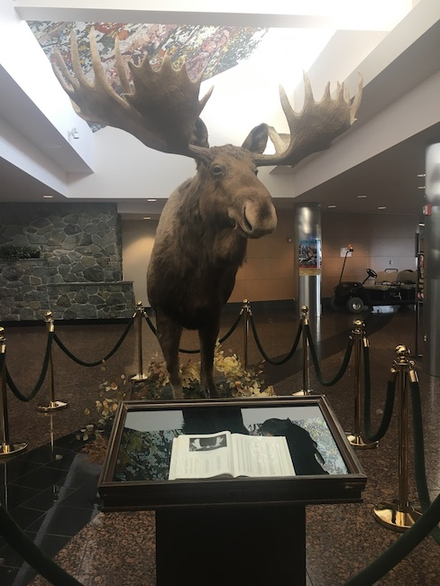
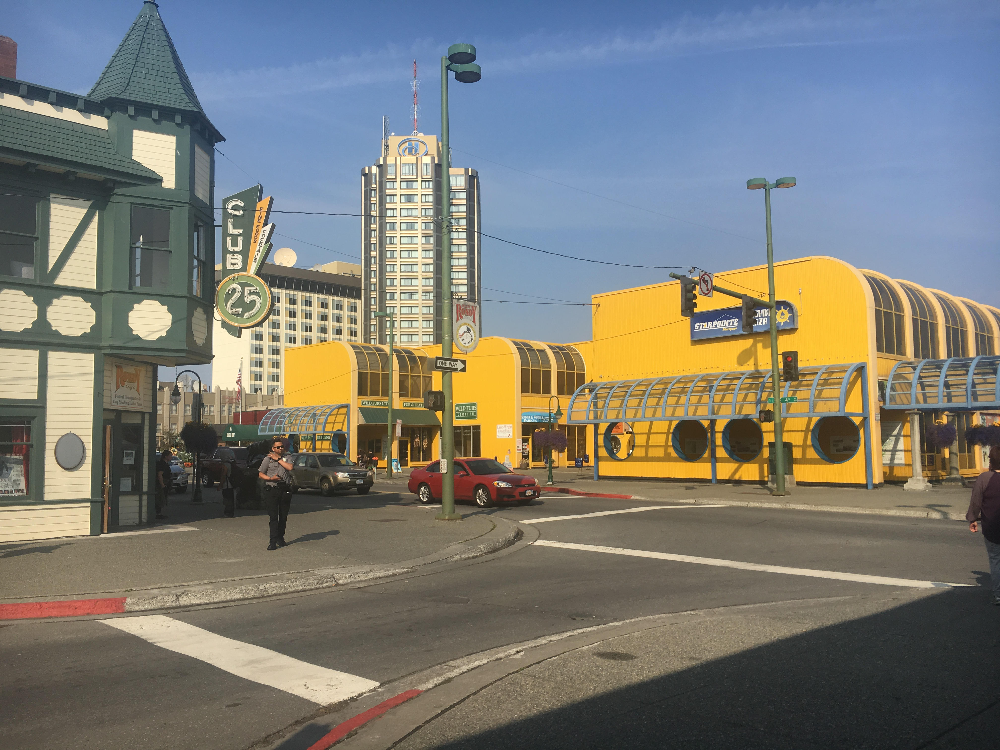

import "../../../src/components/fontawesome";
import { FontAwesomeIcon } from "@fortawesome/react-fontawesome";
import FlattopCarousel from "./FlattopCarousel";
import ResurrectCarousel from "./ResurrectCarousel";
import SewardMuralCarousel from "./SewardMuralCarousel";
import AWCCCarousel from "./AWCCCarousel";
import WinnerCreekCarousel from "./WinnerCreekCarousel";
import DoubleMuskyCarousel from "./DoubleMuskyCarousel";
import Aug28Carousel from "./Aug28Carousel";
import EklutnaCarousel from "./EklutnaCarousel";
import MatanuskaCarousel from "./MatanuskaCarousel";

If you haven't read the first part of my itinerary, [check it out here!](http://melted-boundary.surge.sh/travel/alaska/juneau)

Reminder that if the tag icon appears next to something, it means a coupon is available in the [Tour Saver Coupon Book](https://www.toursaver.com/):

<FontAwesomeIcon icon={['fas', 'tag']} size="3x"/>

### Anchorage & Seward: Aug. 26

<FontAwesomeIcon icon={['fas', 'plane']} size="lg"/>
&nbsp;&nbsp; - Fly to Anchorage from Juneau.

<FontAwesomeIcon icon={['fas', 'hiking']} size="lg"/>
&nbsp;&nbsp; - Flattop Mountain via the Flattop Mountain Shuttle

<FontAwesomeIcon icon={['fas', 'utensils']} size="lg"/>
&nbsp;&nbsp; - Humpy's Great Alaskan Alehouse, The Cookery

<FontAwesomeIcon icon={['fas', 'car-side']} size="lg"/>
&nbsp;&nbsp; - Car rental for Anchorage to Seward

<FontAwesomeIcon icon={['fas', 'hotel']} size="lg"/>
&nbsp;&nbsp; - Moby Dick Hostel

 

##### Lunch

After landing in Anchorage, I realized I made a mistake on the itinerary and accidentally booked our car rental way later that day.
After recovering from my mini-freakout, Eric and I headed to the information desk at the airport to figure out what we could do in the meantime.
The person at the info desk was super helpful. He let us know we could store our luggage at the airport for super cheap while we went exploring.
Then, he recommended a place called [Humpy's](https://www.humpysalaska.com/) for lunch and a [hike at Flattop Mountain with transportation provided.](http://www.hike-anchorage-alaska.com/Schedule)

Luckily, the bus from the airport has a stop just a block from Humpy's. We had some delicious fish and chips and burgers!
Everyone here was super friendly and the food hit the spot. 

##### Flattop Mountain
Unfortunately, it seemed like we wouldn't make the [Flattop Shuttle]((http://www.hike-anchorage-alaska.com/Schedule)) in time,
so we called them asking if they could wait for us. Turns out, we saved the day! In order for the shuttle to leave, they need a minimum
number of passengers and they needed exactly 2 more people in this case. Lucky us! Turns out we could have our Humpy's and eat it too!

<FlattopCarousel />

The shuttle leaves from the downtown bike rental shop which is walkable from Humpy's. We had to sign some waivers and our driver Peter
made sure we all had proper shoes and instructions on what to do based on difficulty level. I have to say this was the most difficult hike we did our entire trip, albeit gorgeous.
My boyfriend is afraid of heights and he mentally struggled with one particular part toward the end. I think you can do this hike even if you're afraid of heights, but as soon as it looks scary, just turn around.
The difficulty only increases. But please don't let that scare you! It's so worth it, and if you are too scared, at least do the super easy Blueberry Loop, admire the beautiful flowers, and pick some berries!

##### Anchorage to Seward

<FontAwesomeIcon icon={['fas', 'tag']} size="lg"/>
&nbsp;&nbsp; By the time we got back downtown from Flattop, it was time to take the bus back to the airport and pick up our rental car! The Toursaver coupon book has deals on rental cars as well as the train,
but if you're planning on doing Anchorage, Seward, AND Girdwood, I think a rental car is preferrable. The drive is also beautiful as you take the scenic Seward Highway along the water almost the whole time.

##### Dinner

Once we arrived in Seward, we were hungry (a common theme), so we went to [The Cookery](https://www.cookeryseward.com/), which has great views of the water.
It was one of the more expensive restaurants we went to, but we didn't feel weird dressed casual. The food was good, but the dessert was amazing!
I rewarded myself with some Alaskan Brewing Co. Beer since I knew I would only have a limited time with my new favorite beer as it's not distributed to South Carolina :(

##### Lodging

We stayed at the [Moby Dick Hostel in Seward](http://www.mobydickhostel.com/) since we had a Kenai Fjord cruise that left from there the next day.
The hostel was great, and super close to everything. The rooms were clean and the check-in/check-out was easy.
When we arrived, the office was closed so they even left notes for us on how to check-in properly and when they would be back to take payment.
They take cash or card, but it's a bit cheaper if you use cash. They even have private rooms if you prefer.

### Seward & Girdwood: Aug. 27

<FontAwesomeIcon icon={['fas', 'hiking']} size="lg"/>
&nbsp;&nbsp; - Seward Mural Walk, Winner Creek Trail

<FontAwesomeIcon icon={'ticket-alt'} size="lg"/>
&nbsp;&nbsp; - Kenai Fjord Wildlife Cruise, Alaska Wildlife Conservation Center

<FontAwesomeIcon icon={['fas', 'utensils']} size="lg"/>
&nbsp;&nbsp; - Resurrect Art Coffee House and Gallery, Zudy's Cafe, Reindeer hotdogs, Double Musky Inn

<FontAwesomeIcon icon={['fas', 'car-side']} size="lg"/>
&nbsp;&nbsp; - Car rental for Seward to Anchorage

<FontAwesomeIcon icon={['fas', 'hotel']} size="lg"/>
&nbsp;&nbsp; - Alyeska Hostel

 

##### A Change of Plans

<FontAwesomeIcon icon={['fas', 'tag']} size="lg"/>
&nbsp;&nbsp; When we woke up, we had planned to take <a href="https://majormarine.com/">a cruise of the Kenai Fjords National Park with Major Marine Tours,</a> complete with all you can eat salmon and prime rib!
Unfortunately, a wildfire in Denali had caused really bad air quality in Seward that day. Major Marine Tours called us letting us know they had cancelled the cruise that day.
While that news really stunk, they made the right call, and gave us the opportunity to either reschedule or receive a full refund, which we did since we were running on a tight schedule.

##### Coffee

In order to figure out what our new plans should be, we needed coffee. There was the cutest coffee shop near our hostel
called [Resurrect Art Coffee House and Gallery](https://resurrectart.com/). It was built in what looked like an old chapel and, not only was it a coffee shop,
but it was also a gallery for local artists. Not just expensive gallery stuff either. We bought some cards and stickers from the shop.
While we sipped our coffee we also met the sweetest dog named Mable Bean!

<ResurrectCarousel />

 

##### Seward Mural Walk

Once we were done with our coffee, we weren't ready to leave Seward because it's such a beautiful town, so we [downloaded a map to try and find all of the wonderful murals painted around town.](https://www.alaska.org/guide/seward-mural-capital-walk). They were stunning and each one has a little plaque next to it explaining
what the mural means to Seward. 

<SewardMuralCarousel />

##### Lunch

The air quality started to get pretty bad and our selves pretty hungry! We decided we'd grab a bite to eat and then figure out something to do between Seward and Girdwood (our next stop) that we could breathe during.
We got [lunch at Zudy's](https://zudyscafe.com/) which is near the water. It's a cute cafe with super fresh ingredients and unbelievable pastries. It was perfect for first lunch... or second breakfast... spoiler alert: we get more lunch later!
It was also right next to the Salmon Sisters store which we popped into to look for some gifts. I really loved their clothes! Unfortunately, I think the store is now permanently closed in that location.

##### Alaska Wildlife Conservation Center

When we asked around Seward for recommendations of what to do, many people mentioned checking out the [Alaska Wildlife Conservation Center (AWCC).](https://www.alaskawildlife.org/)
Since we missed out on seeing the wildlife in the water with the cruise, it seemed like a great alternative. We checked out of our hostel,
and took the rental car to the AWCC. The AWCC does some great work rehabilitating injured and orphaned animals. They even helped restore the
Wood Bison population in Alaska!! 

<AWCCCarousel />

Big tip: Make sure you bring binoculars with you! This was an excursion we did where they really came in handy. We saw tons of animals from moose to bears to beavers!
We wanted to make sure we saw Alaska wildlife while we were here, and while it would've been cool to see them in the actual wild, it was good to know by seeing them here, we were giving our money to a worthwhile cause.
Having said that, we did pick up some delicious reindeer hotdogs while we were there and it felt a little awkward eating them in front of the reindeer.

##### Lodging

When we were done at the AWCC, we wanted to make sure we checked in to our next hostel.
We loved staying at the [Alyeska Hostel in Girdwood](http://www.alyeskahostel.com/)! The check-in process was so easy. Just call
the number that's left for you whenever you have any questions, which we didn't have any because
the instructions and rules left for us were so thorough! There were also tons of recommendations, brochures, and trail maps there,
so we took a look to figure out our next adventure. 

##### Winner Creek Trail

<WinnerCreekCarousel />

We wanted to make sure we got a hike in that day but we were pretty tired, so we looked for an easy trail.
We decided on the Winner Creek Trail which starts at the Hotel Alyeska ski resort. It was a very pretty trail
and super easy too! We got to a section where you need to use a hand tram to cross a gorge. Unfortunatlely,
the tram was out of order, but we wanted to see the rest of the trail, so we drove to the other entrance and finished the other half of the trail.

##### Dinner

**Now my favorite part of the day... dinner!!** All the recommendations I got were for a restaurant called the
[Double Musky Inn](https://doublemuskyinn.com/). I'm going to say this was the best meal we had the entire trip!
It was also the most "all out" we went for a meal I'd say!

 

<DoubleMuskyCarousel />

### Anchorage: Aug. 28 and a little bit of Aug. 29

<FontAwesomeIcon icon={['fas', 'plane']} size="lg"/>
&nbsp;&nbsp; - Return rental car to Anchorage airport

<FontAwesomeIcon icon={['fas', 'hiking']} size="lg"/>
&nbsp;&nbsp; - Matanuska Glacier with Adventurous Winos

<FontAwesomeIcon icon={'ticket-alt'} size="lg"/>
&nbsp;&nbsp; - Eklutna Historical Park

<FontAwesomeIcon icon={['fas', 'utensils']} size="lg"/>
&nbsp;&nbsp; - Long Rifle Lodge, Simon and Seafort's, Great Harvest Bread Co.

<FontAwesomeIcon icon={['fas', 'hotel']} size="lg"/>
&nbsp;&nbsp; - Nikki Dee's AirBnB

 

##### Matanuska Glacier and Lunch with Adventurous Winos

<FontAwesomeIcon icon={['fas', 'tag']} size="lg"/>
&nbsp;&nbsp; If I could only write about one day of the trip, it would be this one! We dropped off our
rental car at the airport and got picked up by our tour guide (and now our best Alaska friend) Pam for the <a href="https://adventurouswinos.com/northern-adventure">Northern Adventure Tour with Adventurous Winos.</a>
They will work with you to coordinate when and where to pick you up, so it's really up to your own schedule! Pam had snacks and water available in the car as well as extra hats if needed.
We were the only ones on the tour too! I'm not sure if that's usually the case, but it meant Pam really catered the trip to us!

First, we drove out to the Matanuska Glacier where we got fitted with helmets and clamps since we were about to walk over a literal glacier!!
The glacier was one of the most gorgeous things I've ever seen! We also happened to color coordinate with it which made for some awesome pictures. 
Make sure to bring a baseball cap to wear underneath your helmet if you have a small head like me and a water bottle. At one point on the hike,
you get to fill it up with some glacier water which is delicious. I never thought I'd say water was delicious, but here we are!
If you aren't an avid hiker, don't worry. It actually wasn't that difficult. You just have to be assertive with your stepping, and nothing felt dangerous!

<MatanuskaCarousel />

After the hike, we went to the [Long Rifle Lodge](http://www.longriflelodge.co/) for lunch and beer which is included with the tour.
If you've been reading my posts, you can probably guess that on the beer list, I chose something from
Alaskan Brewing Co. Then it was time to return to Anchorage! But Pam took us on a surprise stop...

<Aug28Carousel />

##### Eklutna Historical Park

One of the things I really wanted to see was the [Eklutna Historical Park](http://www.eklutnahistoricalpark.org/). If you remember from earlier in the post,
I messed up our car rental time, so we couldn't make it to the park due to being car-less. Well,
Pam took us! The park is home to both an Orthodox Christian Church as well as spirit houses, which are
an Athabaskan tradition. The houses have the Orthodox Christian cross on them showing a blend of the cultures,
making it a super unique site. 

<EklutnaCarousel />

##### AirBnB

After Eklutna, Pam dropped drove us around downtown Anchorage and shared some of her favorite spots for food, fun, shopping, etc.
She even dropped us off at our AirBnB which was kind of far from downtown. When she asked us where we were getting picked up the next morning,
she offered to drive us so that we didn't have to take the bus or an Uber (another reason Pam is the best)! [Our AirBnB](https://www.airbnb.com/rooms/19457263?source_impression_id=p3_1605235654_BdKfnYnpEEypfsJr) was great 
although, if we didn't have Pam, I would've liked to have the rental car, or have taken a Lyft/Uber price into account. Other than that,
the house was really nice and breakfast and coffee were provided! It felt good to have our own room, and Nikki was such a great host :)

##### Dinner

Pam had recommended [Simon and Seafort's Saloon and Grill](https://simonandseaforts.com/), so we took a Lyft from our AirBnB to downtown to check it out.
The place was full without a reservation, but they luckily have a bar area (I guess that's the "Saloon" part) with tons of
seating that is first come, first served. We also got a full menu and a seat by the window overlooking the water. The
food here was delicious and I even got to try baked Alaska for the first time!

##### The Next Morning

So I said this post was going to dive a little bit into August 29, so here it is! Pam picked us up super early from our AirBnB
and took us to the most wonderful bakery called [Great Harvest Bread Co.](http://greatharvestanchorage.com/bread-and-sweets) We got a loaf of cinnamon chip bread, which I still crave to
this day! Their cinnamon rolls also looked heavenly! We got some much needed coffee here as well. Pam also recommended the Snow City Cafe
for breakfast but we unfortunately didn't have time to stop there. The bread we got here we ate all the way to Denali which I'll talk about in my next post!
Stay tuned for that! And big shoutout to Pam for making our Anchorage adventure great!