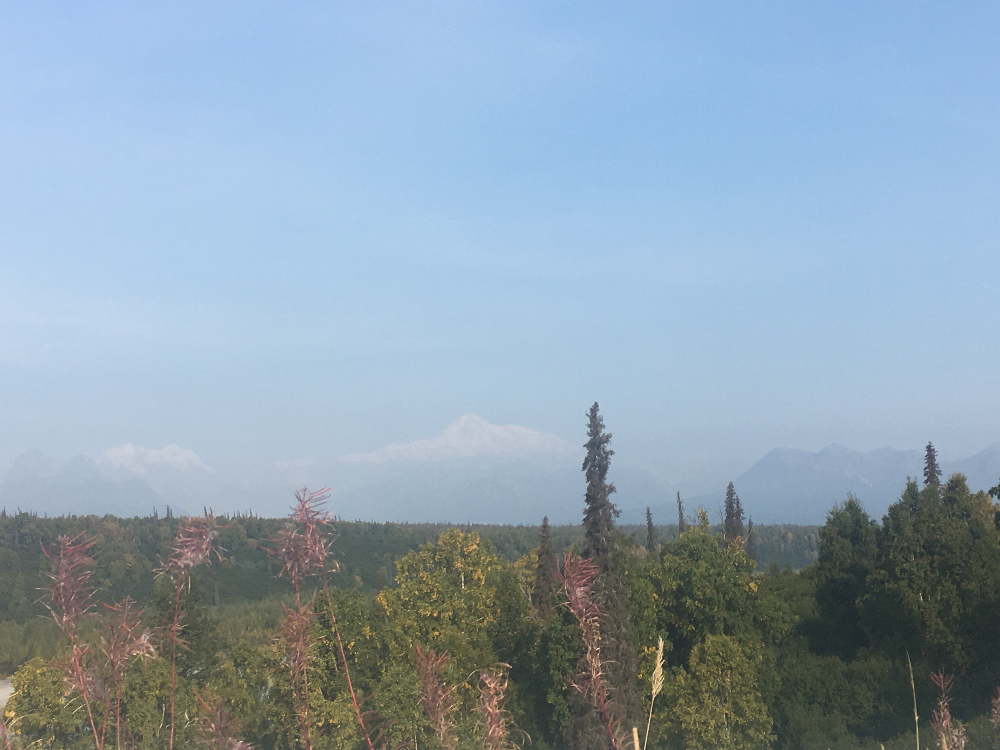
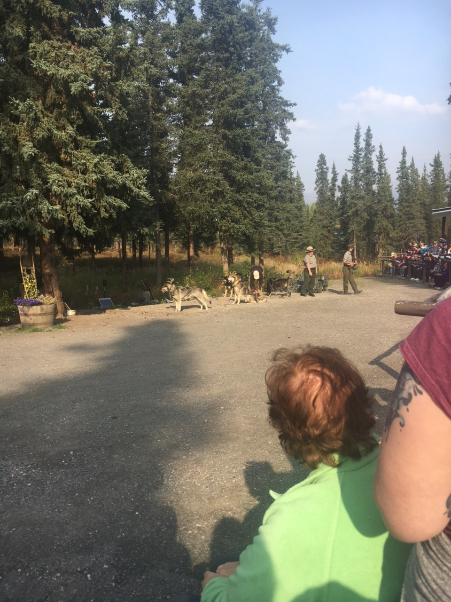
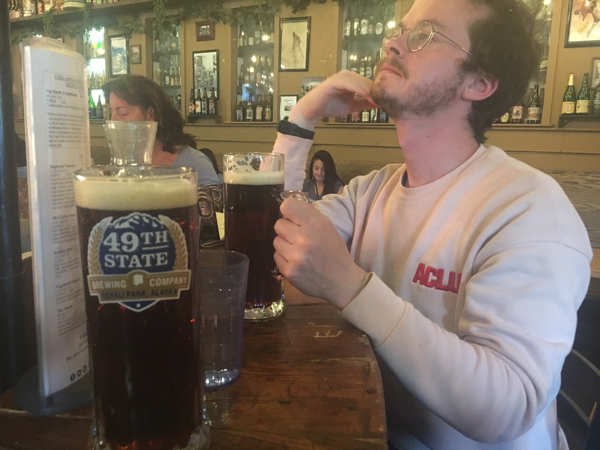
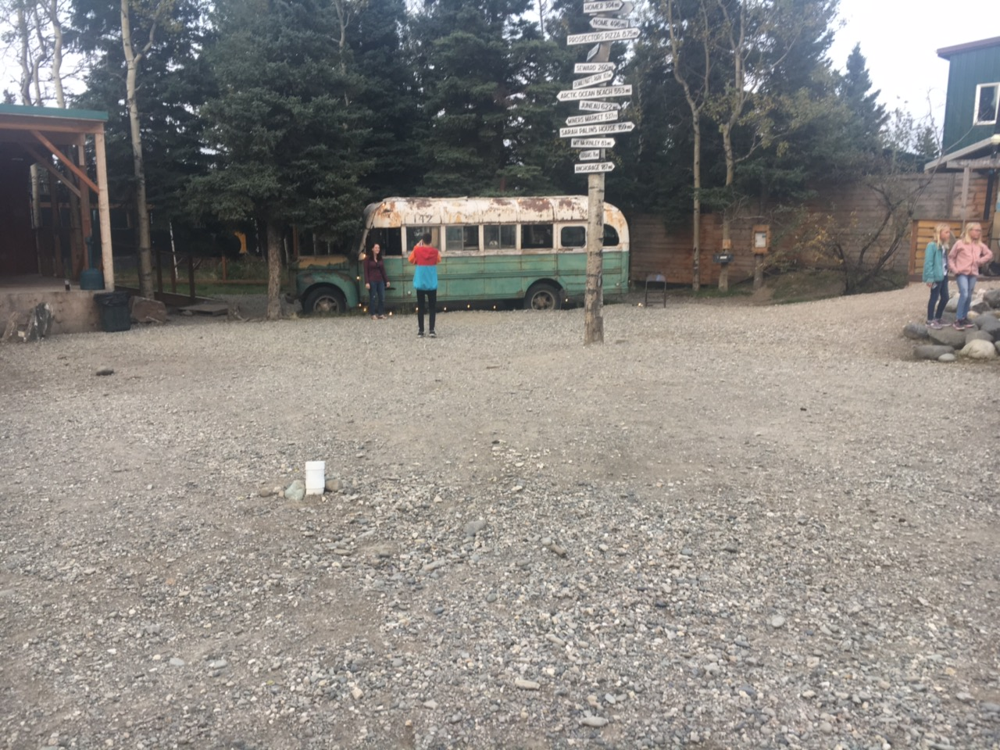

import "../../../src/components/fontawesome";
import { FontAwesomeIcon } from "@fortawesome/react-fontawesome";
import SavageLoopCarousel from "./SavageLoopCarousel";
import MountHealyCarousel from "./MountHealyCarousel";
import TripleLakesCarousel from "./TripleLakesCarousel";
import HealyVideo from "./HealyVideo";

If you haven't read the previous part of my itinerary, [check it out here!](http://melted-boundary.surge.sh/travel/alaska/anchorage-seward-girdwood)

### Denali Day 1: Aug. 29

<FontAwesomeIcon icon={['fas', 'shuttle-van']} size="lg"/>
&nbsp;&nbsp; - Northbound Parks Highway Shuttle

<FontAwesomeIcon icon={['fas', 'hotel']} size="lg"/>
&nbsp;&nbsp; - Denali Hostel and Cabins

<FontAwesomeIcon icon={['fas', 'hiking']} size="lg"/>
&nbsp;&nbsp; - Savage River Loop Trail, Mount Healy Overlook Trail

<FontAwesomeIcon icon={['fas', 'utensils']} size="lg"/>
&nbsp;&nbsp; - Denali National Park cafeteria, Panorama Pizza Pub

 

##### Anchorage to Denali

Since we were planning this trip on a budget and had a limited time in each location, we
needed to find a way to get to Denali early and on the cheaper side. We used
[Airlink's Alaska/Yukon Trails's Northbound Parks Highway Shuttle](https://alaskashuttle.com/product/northbound-parks-highway-shuttle/).

[If you read my last post](http://melted-boundary.surge.sh/travel/alaska/anchorage-seward-girdwood), you know Pam dropped us off at Arctic Adventure Hostel,
our pickup location for the shuttle. I was a bit nervous because the reviews for this shuttle service were not good and I had not received
any type of confirmation e-mail or phone call after booking. But the shuttle showed up right on time and we were the
only ones, which was nice! Our driver picked us up at 7:45 AM and we said goodbye to Pam. 

Our driver was so nice! He let us stop at a Mt. Denali view point and we were shocked that we could actually see the mountain. Even without the wildfires, the chance of it
being visible are low and WITH the wildfires, nearly impossible. The low chances made us appreciate the view even more!

##### Savage River Loop Trail

We were dropped off at the Denali Bus Depot parking lot. There, we were able to rent lockers to store our bags,
so make sure you have some quarters with you if you plan to get right to your hike. The bus depot has everything you
could possibly need before you start your day. They have a gift shop, snack shop, coffe shop, water station, maps, and
park rangers that are super helpful if you have any questions. We asked one ranger at the information desk the
best way to get to the [Savage River Loop Trail](https://www.nps.gov/dena/planyourvisit/savagecanyon.htm) and he said that we could actually walk to get there. He gave us a map
and away we went.

<SavageLoopCarousel />

The trail was beautiful and very flat. I think this was the only hike we went on where we felt close to the ground the whole time!
The most memorable feature of this hike was all of the beaver dams. Unfortunately, no beavers were seen, but the dams were so impressive!
I will say, it is important that you have good hiking shoes for the water! There were a couple of mushy sections, but nothing that went up past my hiking boots.

##### Lunch

The Savage River Loop Trail was actually pretty short at 1.7 miles, so we had a lot of daylight left to fill with hiking.
But, we needed food to fuel up for our next hike! Luckily, there's a cafeteria in the park with all the basics. It's near
all of the gift shops and the information center too so it's in a super convenient location.

##### Mount Healy Overlook Trail

<MountHealyCarousel />

After lunch, we were ready to hit the trails again. We asked a park ranger at the information center what he recommended. He suggested we tackle the
[Mount Healy Overlook Trail](https://www.nps.gov/dena/planyourvisit/overlook.htm) after telling him about some of our other hikes in Alaska. It was definitely a contrast from the Savage River Loop Trail.
Savage River was so flat and Mount Healy was very steep and got pretty high in elevation, so it was a good thing we ate so much food beforehand! The views 
were great and, unlike Flattop, didn't have any scary parts! Eric still had some acrophobia on this hike, but it certainly wasn't as bad.

<HealyVideo />

##### Check-in at Denali Hostel

We chose Denali Hostel because not only did it fit our budget, but it also has a free shuttle to and from the bus depot. However, I just checked their [website](https://www.denalihostel.com/faqs),
and it looks like they may suspending their shuttle service in the future.
Something else that was cool about the hostel was that we were able to split the price of a double bed! The common area was also super nice!
There was free coffee available and the front desk had some supplies and snacks available for purchase. We asked the person at the front desk
recommendations for dinner and she suggested Panorama Pizza Pub which was walkable, just across the street from the hostel!

##### Dinner

We took Denali Hostel's suggestion to eat at [Panorama Pizza Pub](https://www.facebook.com/PanoramaPizza/),
and it was great! It had pizza and beer (what more do you need?!) and they also had some board games you could play.
Eric and I played lots of rounds of Guess Who!

Another option for food across the street was McKinley Creekside Cabins Cafe which supposedly has the best cinnamon rolls.
Unfortunately we didn't have time to make it over there, but if you need breakfast, it sounds like a good spot!

### Denali Day 2: Aug. 30

<FontAwesomeIcon icon={['fas', 'shuttle-van']} size="lg"/>
&nbsp;&nbsp; - Denali Hostel and Cabins Shuttle, Denali Parks Village Shuttle, and Dine Denali Shuttle

<FontAwesomeIcon icon={['fas', 'hiking']} size="lg"/>
&nbsp;&nbsp; - Triple Lakes Trail

<FontAwesomeIcon icon={['fas', 'utensils']} size="lg"/>
&nbsp;&nbsp; - Denali Parks Village, 49th State Brewing

<FontAwesomeIcon icon={'ticket-alt'} size="lg"/>
&nbsp;&nbsp; - Sled Dog Demonstration

 

##### Triple Lakes Trail

When we arrived at the bus depot, we once again asked the park ranger for advice on what we should hike that day.
She suggested if we were up for a long hike to do the [Triple Lakes Trail](https://www.nps.gov/dena/planyourvisit/triple.htm).
She also made sure we had enough water and snacks for the hike since it can take between 4-5 hours to do the 9.5 miles one-way.
Luckily, she said there were a few places to eat at the end of the trail. This was probably one of my favorite hikes just because
it was the longest and had the most elevation variation. You get to see 3 different lakes, hence the name.
We saw moose tracks too and ran into hikers who saw a moose swimming in one of the lakes. The route definitely felt more enclosed than
Mt. Healy despite the high elevation. Nothing was scary or super difficult, just long!

<TripleLakesCarousel />

##### Lunch

We did it! We did the 9.5 miles! Now to celebrate with burgers and fries! The [Denali Park Village](https://www.denaliparkvillage.com/) is a lodge
that is at the end of the trail and you don't have to be a guest to eat at the restaurant they have there! It was the perfect
reward! We were silly to think we'd have the energy to do the full 9.5 miles back, but we didn't so we took the free Denali Park Village shuttle
to the bus depot. Again, you don't have to be a guest to take advantage of the shuttle. 

##### Sled Dog Demonstration

We were so pooped after the hike, but still wanted to take advantage of the time we had left in Denali.
We made it back to the park just in time to head to one of their free sled dog demonstrations. The bus we took left from the 
information center. Before the demonstration, you can pet some of the dogs and wander the grounds. There's even a tiny
"museum" of sorts that tells you about the history between the dogs and Denali. I would say the demonstration was definitely targeted
towards kids but the dogs were so cute and with our legs out of commission, it was a perfect thing to do!

##### Dinner and Drinks

Our hostel-mates in Girdwood told us we had to check out [49th State Brewing](https://www.49statebrewing.com/denali) while in Denali.
We got there by taking the [Dine Denali Shuttle](https://www.dinedenali.com/), which picks up and drops off at the bus depot. 
I think the shuttle only cost like $5 a person for a day pass. Make sure to have cash on hand and leave a tip for the bus driver.
It can also take you to a few other restaurants in the area, so if you are in Denali longer, it's definitely something to check out.

The food and drinks at 49th State Brewing were amazing! The beer we had even won some kind of worldwide award. They also have the bus from the movie
_Into the Wild_ that you can take pictures with!

When we were done, we boarded the Dine Denali Shuttle and waited at the depot for the hostel shuttle (lots of shuttles). 
We might have also gotten more pizza from the Pizza Pub, but let's keep that on the downlow...

[Check out the last part of the Ultimate 1 Week Alaska Itinerary as we head to Fairbanks!! Thanks for reading!](http://melted-boundary.surge.sh/travel/alaska/fairbanks)