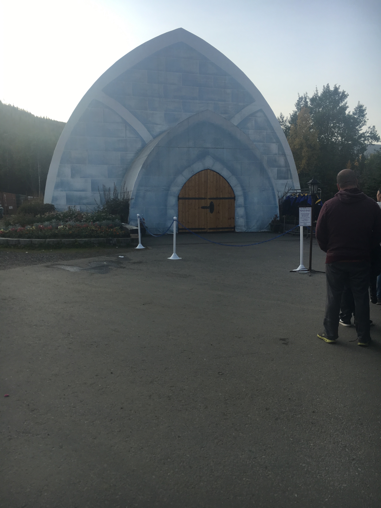
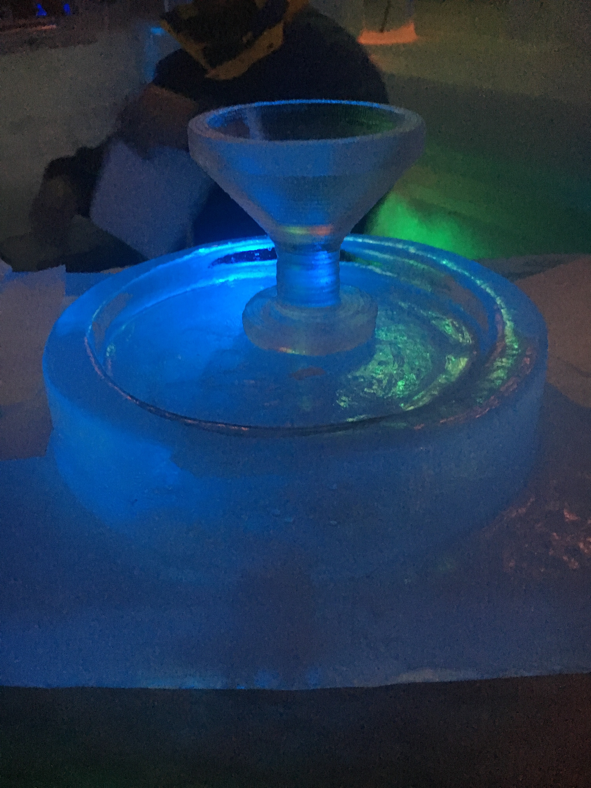
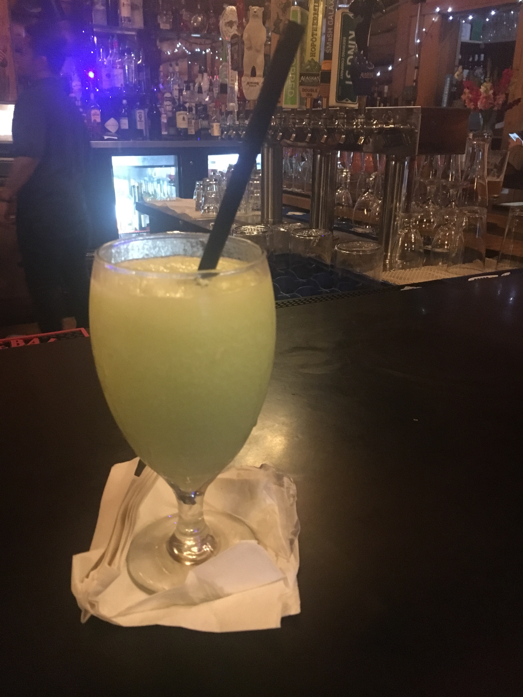
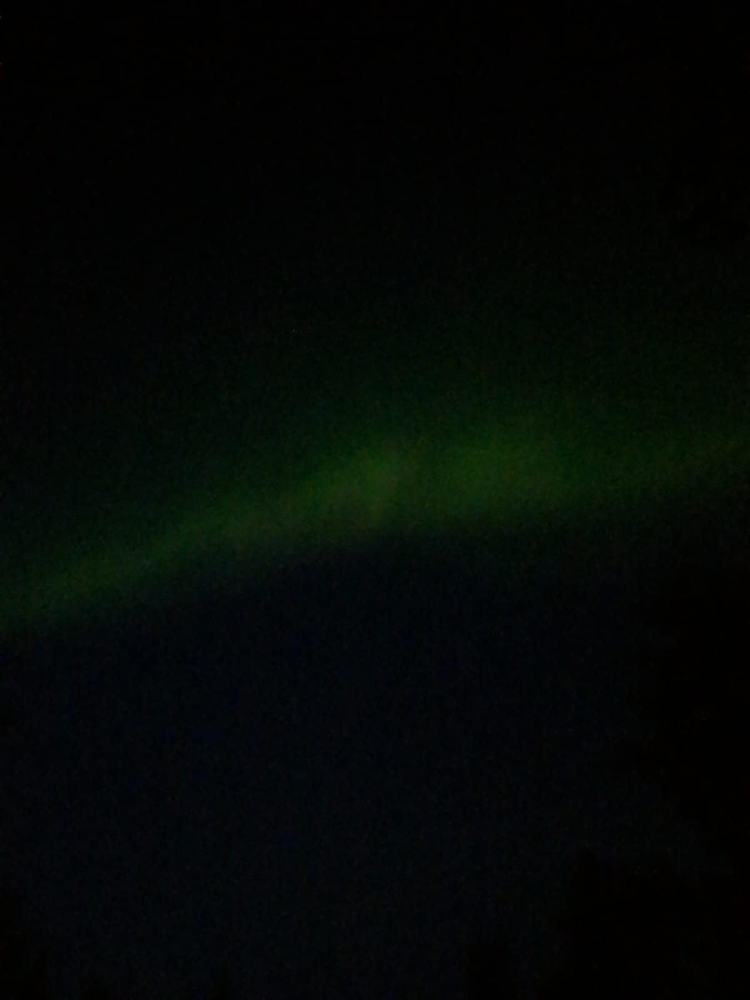
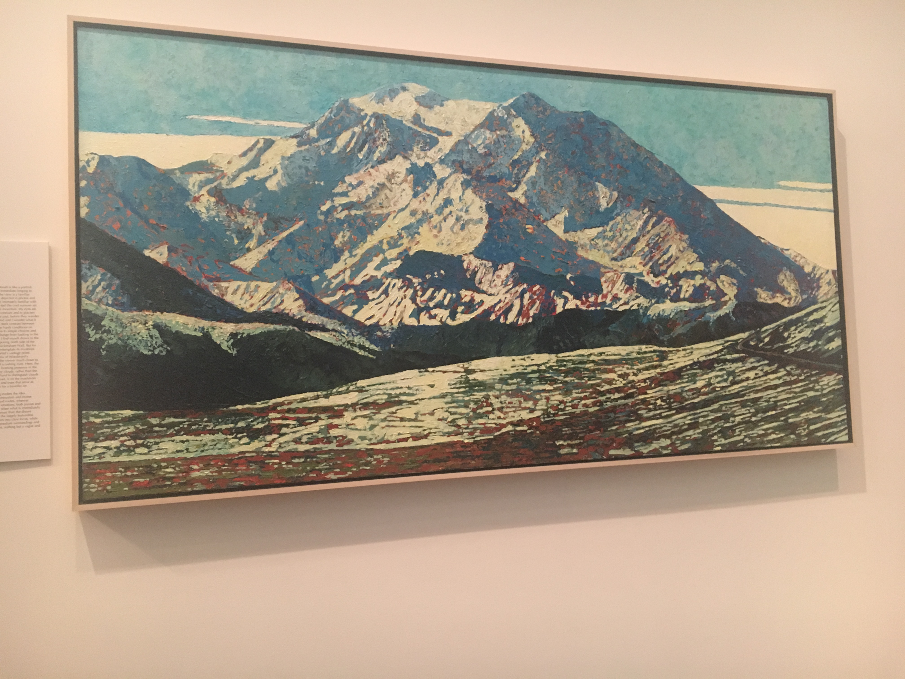

import "../../../src/components/fontawesome";
import { FontAwesomeIcon } from "@fortawesome/react-fontawesome";
import MuseumCarousel from "./MuseumCarousel";

Well, it's time for the last part of the Ultimate 1 Week Alaska Itinerary. I've really enjoyed writing these,
and reliving all the memories from the trip of a lifetime. You can check out the [previous entry here.](http://melted-boundary.surge.sh/travel/alaska/denali)

### Fairbanks, Alaska: Aug. 31

<FontAwesomeIcon icon={['fas', 'shuttle-van']} size="lg"/>
&nbsp;&nbsp; - Northbound Parks Highway Shuttle

<FontAwesomeIcon icon={['fas', 'car-side']} size="lg"/>
&nbsp;&nbsp; - Car rental from Fairbanks Airport

<FontAwesomeIcon icon={['fas', 'hotel']} size="lg"/>
&nbsp;&nbsp; - A Little Piece of Heaven Bed and Lodging AirBnB

<FontAwesomeIcon icon={'ticket-alt'} size="lg"/>
&nbsp;&nbsp; - Chena Hot Springs, Aurora Ice Museum, Northern Lights

<FontAwesomeIcon icon={['fas', 'utensils']} size="lg"/>
&nbsp;&nbsp; - Chena Hot Springs Restaurant

 

##### Denali to Fairbanks

[In my last post](http://melted-boundary.surge.sh/travel/alaska/denali) I talked about using [Northbound Parks Highway Shuttle](https://alaskashuttle.com/product/northbound-parks-highway-shuttle/)
to get from Anchorage to Denali. Well, we used the same exact one to get from Denali to Fairbanks, except this time we got to sleep in and leave at 12:45 PM
from the Denali Bus Depot.

This following bit is important because we were almost left behind...

When we were dropped off at the Denali Bus Depot from Anchorage, we were dropped off in the parking lot, so we decided to wait there for the shuttle to pick us up. 
This, however, was a huge mistake! We were supposed to meet our driver at the "Shuttle Pickup" area in the Bus Depot. This is where all the other shuttles mentioned in my previous post pick up and drop off. 

Even though the driver tried calling me, her call went straight to voicemail probably due to bad service. Luckily, she was able to answer our call and pick us up at the correct location,
which I want to reiterate is the **SHUTTLE PICKUP AREA IN THE BUS DEPOT!!!** So, crisis averted.

Our driver was a bit kooky, and she definitely had bad reviews on Google, but she was such a nice woman!
She made sure everyone was going to the right place and she made sure she dropped us off at the exact location for where we were picking up our car rental.

##### Check into AirBnB

Once we were dropped off at the Fairbanks Airport, my boyfriend noticed that our [AirBnB (A Little Piece of Heaven Bed and Lodging)](https://www.airbnb.com/rooms/31039379?source_impression_id=p3_1609456107_B3FUmpkjd88NZBwe)
listing mentioned a 4-wheel drive vehicle was recommended. Even though we didn't initially book one,
the Alamo representative we spoke to was able to readjust our rental so that we didn't have to pay too much more!!

Once we had our car we drove to the AirBnB where we met our host April. She was so awesome! She made sure we knew all the details of the place.
She also provided us with hot cocoa, tea, and coffee, and the room was equipped with a sauna. Something that's important to note
is that the listing is marked as "Private Room" because [she has another room in the same guest area available for booking](https://www.airbnb.com/rooms/31474171?source_impression_id=p3_1609456571_bvbsAhXKZhX39cJZ) but it's still very separate from the main house.

##### Aurora Ice Museum

Now that we were settled into our room we took the 1.5 hour drive to [Chena Hot Springs Resort](https://chenahotsprings.com/).
Once there, we headed to the Aurora Cafe/Activity Center where bought our tickets to tour the Aurora Ice Museum. We were surprised that it was almost sold out
when we got there, so definitely purchase tickets ahead of time! The Ice Museum was so cool! Everyone gets a gigantic Arctic coat to wear inside and if you are of
legal drinking age, you can have an appletini served in a martini glass made of ice. Ice sculptures were abound with some interactive exhibits as well, 
such as a xylophone made of ice. 

##### Dinner

Once we were finished, we decided to grab dinner at [the restaurant on the resort property](https://14opgi45xnv11ge10o1j84m8-wpengine.netdna-ssl.com/wp-content/uploads/2020/12/Current-Menu-with-pricing-and-appetizers-2020.pdf). The wait was 
super long and the restaurant seemed so understaffed but luckily we were able to find a seat at the bar which
has a full menu. The food portions were great and honestly the most bang for our buck in Alaska. 
They also had some delicious drinks! I got one called a Moose Juice!

##### Hot Springs

Unfortunately I don't have any pictures of the hot springs because phones can't get wet.
But what I do have are the memories! Once we got to the springs, we rented some towels,
changed into our bathing suits in our respective locker rooms and relaxed in the springs. It was one of the most
perfect ways to spend our last night in Alaska especially after all the hiking! The only thing that could've made
the experience better was remembering to bring flip flops... and seeing the Northern Lights.
But wait... there's more.

##### Northern Lights

So no forgotten flip flops appeared when we needed them, but I would so rather have the Northern Lights.
When we got back to our AirBnB, April informed us that there was actually a possibility that night to see them,
so we stayed up late and made some hot cocoa and just waited. It was definitely worth the wait.
Watching the lights was like watching beautiful green waves dance across the sky! We learned at the
museum we went to the next day that people used to believe it was the souls of dead deer prancing in the sky.

The pictures do not do the lights justice unfortunately. It definitely looks more like a sad evaporated glow worm.

### Fairbanks, Alaska: Sep. 1

<FontAwesomeIcon icon={'ticket-alt'} size="lg"/>
&nbsp;&nbsp; - Museum of the North

<FontAwesomeIcon icon={['fas', 'utensils']} size="lg"/>
&nbsp;&nbsp; - The Cookie Jar

<FontAwesomeIcon icon={['fas', 'plane']} size="lg"/>
&nbsp;&nbsp; - Fly back home

 

##### Breakfast

We grabbed breakfast at The Cookie Jar which was honestly was just okay. It was typical breakfast fare
and the portions were great but based on the rave reviews, I was expecting a bit more. However, the service was
great and although it was packed, we were seated and got our food quickly.

##### Museum of the North

I know most people don't think about adding a museum to their itinerary when they're going to enjoy all the nature Alaska has to offer.
But in Fairbanks, [University of Fairbanks's Museum of the North](https://www.uaf.edu/museum/) is a must-see in my opinion. 
It has so many artifacts, art, and even scientific short films to see. We saw a short movie about the science behind the Northern Lights. 
Some other highlights of the museum for me were the mummified 36,000 year old steppe bison and 
the exhibit on Alaska's participation in WWII and specifically how that affected the Aleuts.

<MuseumCarousel />

##### Conclusion

Although we had a few more places we wanted to see, we had to hurry back to Charleston. A hurricane was on its 
way and we had to figure out evacuation plans as well as making sure someone was able to pick up our dog, Wendy,
from the boarders. It was definitely a dream vacation and thank you for reading through my memories of it. If you're
considering a trip to Alaska, what are you waiting for? It's one of the most beautiful places in the world and you
will have so many wonderful memories. The following links are to the other parts of my itinerary if you would like to check them out:

- [Juneau](http://melted-boundary.surge.sh/travel/alaska/juneau)
- [Anchorage, Seward, and Girdwood](http://melted-boundary.surge.sh/travel/alaska/anchorage-seward-girdwood)
- [Denali](http://melted-boundary.surge.sh/travel/alaska/denali)

Thanks for reading :) 
