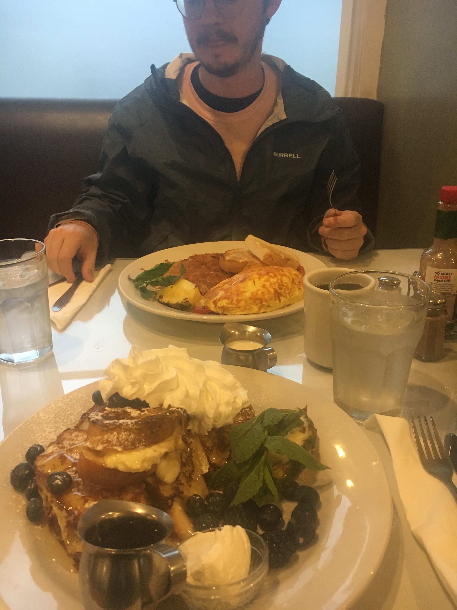
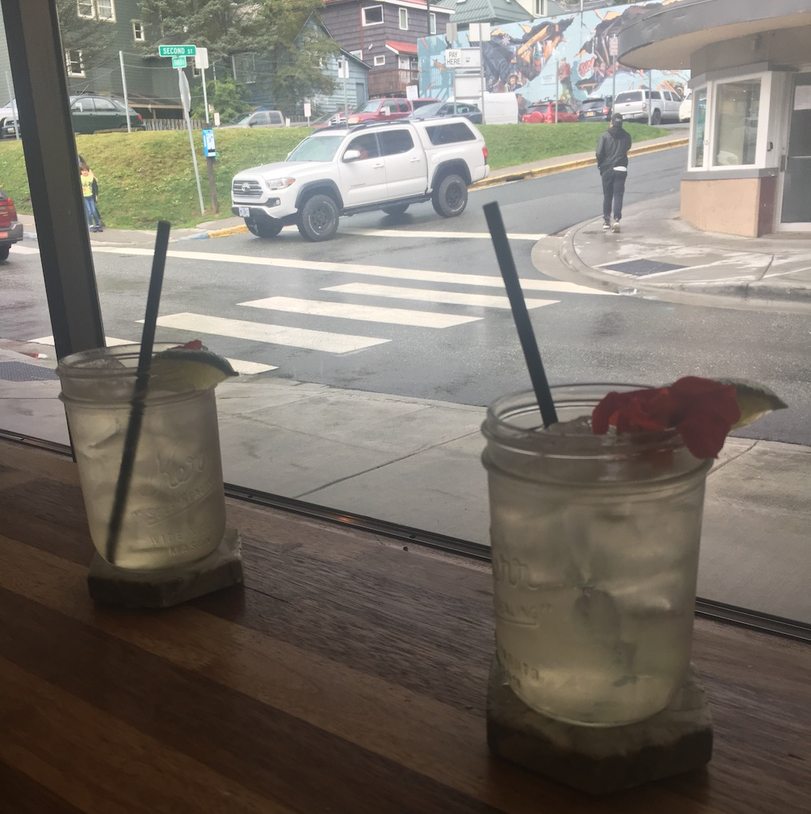

import "../../../src/components/fontawesome";
import { FontAwesomeIcon } from "@fortawesome/react-fontawesome";
import DriftwoodCarousel from "./DriftwoodCarousel";
import MendenhallCarousel from "./MendenhallCarousel";
import JuneauCarousel from "./JuneauCarousel";

### Planning - Dates, Coupons, and Transportation

My boyfriend and I went to Alaska from August 24, 2019 to September 1. This was the perfect time to go to Alaska because it was still technically tourist season, but towards the end so while tourist activities were still available, they weren't as crowded. Plus, this marks the beginning of Northern Lights season (more on that later).

Planning a trip to Alaska can be expensive. It's a huge state so travel is long and transportation is in low supply. Furthermore, it's pretty isolated from the rest of the U.S. making goods within the state pretty pricey.
When doing research for the trip, I came across the [Tour Saver Coupon Book](https://www.toursaver.com/) which helped my boyfriend and I save over $200 on excursions. It also served as a helpful planning tool.
With the book, you need to call to book anything to let them know you have the book and also so that you can give them the book number.
Normally coupon books are sort of a scam, so I was skeptical but this was the real deal. **If a tag icon appears next to something, it means a coupon is available in the Toursaver book:**

<FontAwesomeIcon icon={['fas', 'tag']} size="3x"/>

For flights, I booked through Expedia since that's where I could find the cheapest prices. I was also able to get travel insurance on the tickets.
The trains on the Alaska Railroad are supposed to have gorgeous routes, and the coupon book even has deals on the tickets. However, the cheapest options in most cases were shuttles. 
I planned our initial destination and departing destination based on the cheapest flight options, but this itinerary can go backwards if it's cheaper.

### Juneau, Alaska: Aug. 24 - 26

<FontAwesomeIcon icon={['fas', 'plane']} size="lg"/>
&nbsp;&nbsp; - Fly to Juneau from Charleston.

<FontAwesomeIcon icon={['fas', 'hotel']} size="lg"/>
&nbsp;&nbsp; - Driftwood Lodge

<FontAwesomeIcon icon={['fas', 'hiking']} size="lg"/>
&nbsp;&nbsp; - Mendenhall Glacier

<FontAwesomeIcon icon={'ticket-alt'} size="lg"/>
&nbsp;&nbsp; - Alaskan Brewing Company Tour with Liquid Alaska

<FontAwesomeIcon icon={['fas', 'utensils']} size="lg"/>
&nbsp;&nbsp; - The Sandpiper Cafe, The Hangar on the Wharf, The Rookery Cafe, Pel'meni

<FontAwesomeIcon icon={['fas', 'glass-cheers']} size="lg"/>
&nbsp;&nbsp; - Amalga Distillery

<FontAwesomeIcon icon={['fas', 'shopping-cart']} size="lg"/>
&nbsp;&nbsp; - Rainy Retreat Books

 

##### Lodging

<FontAwesomeIcon icon={['fas', 'tag']} size="lg"/>
&nbsp;&nbsp; After landing in Juneau late at night, we boarded a shuttle from the airport to the <a style="font-weight:bold" href="https://www.dhalaska.com/">Driftwood Lodge</a>.
This is a complimentary service of the hotel and you can also book rides to the airport. The bus will appear right outside the airport and they will call you if you haven't boarded the bus yet.
The rooms have all the basic amenities, the location is great, and the customer service was amazing. 
We met a couple that stayed at the Juneau Hotel and they said it was super noisy and the rooms were pretty gross. I'm happy we stayed at the Driftwood since the Juneau Hotel was another option.

<DriftwoodCarousel />

 

##### Breakfast

We woke up early and went to [The Sandpiper Cafe](https://sandpiper.cafe/) which was right around the corner from the Driftwood.
I cannot recommend this place enough. The customer service was incredible and the food was delicious. I love French Toast and that seems to be a speciality here.

##### Hiking
After breakfast, we waited at the bus stop to get to the Mendenhall Glacier. The bus was not exactly timely so we decided to use Lyft to get there.
Our Lyft driver let us know that Lyft is not authorized in the Mendenhall area. If you tried to use the app to get out of there, it just won't work,
so he gave us his number to call when we were done. Once we reached an authorized area we figured out how to have him "pick us up" in the app.

<MendenhallCarousel />

We got there super early and left around noon. When we got there, it was like having the trail to ourselves, but when we left, it was packed! 
We did all the trails that leave from the visitor's center and stayed at the end to listen to a park ranger give a talk! Must dos are the short trail to the falls and the east glacier loop!

##### Lunch and Coffee
For lunch, our Lyft driver recommended [The Hangar on the Wharf](hangaronthewharf.com). It was expensive and touristy, but the food was still good and the views totally unmatched!
After, we went to [The Rookery Cafe](http://therookerycafe.com/) for some coffee. The coffee was just okay but their other drinks were incredible and from what I heard,
it's the best coffee you can get in Juneau. They also serve breakfast and lunch and that looked really good! 

##### Shopping

While we strolled around with our coffee, we went to some touristy gift shops and the cutest book shop called
[Rainy Retreat Books](https://juneaubooks.com/) that has used and rare books. We also went to a kiosk near the cruise boat launch that had a map of all the statues around Juneau, so we did our own self guided tour.

<JuneauCarousel />

 

##### Drinks
Even after this, we still had time to kill before our brewery tour, so naturally we went to a gin distillery
called [The Amalga Distillery](https://amalgadistillery.bigcartel.com/). They had great drinks and some great gifts for back home. It was next to a really nice outdoors shop, so if you forgot your Patagonia, you can pick one up!

Because we didn't have enough drinks, we did a tour of the [Alaskan Brewing Co. with Liquid Alaska Tours](https://liquidalaskatours.com/tours/alaskan-brewery-tour-tasting-experience/).
Liquid Alaska provides the transportation for you and the brewery provides the tour and the tasting. It was honestly some of the best beer I've had 
and our tour guide was super knowledgable about the brewery's innovative techniques. They also have some awesome gifts in the gift shop!

##### Dinner
After we were dropped off downtown, we were pretty hungry, so we went to a place called [Pel'meni](https://www.facebook.com/pages/Pelmenis/310389622354430), which serves... Pelmeni, a type of Russian dumpling.
This was one of our favorite things we ate on our trip! The place is cash only so make sure you have that ready.

##### Departure
We went back to the Driftwood and made sure we were on the schedule for the next morning's shuttle to the airport.
Next stop: Anchorage! [Check out the next part of the Ultimate Alaska Itinerary here!](https://arrayoflight.gatsbyjs.io/travel/alaska/anchorage-seward-girdwood)