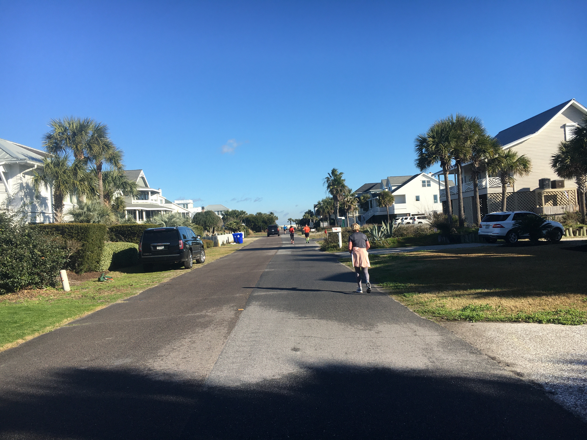

import "../../../src/components/fontawesome";
import { FontAwesomeIcon } from "@fortawesome/react-fontawesome";
import CharliePostCarousel from "./CharliePostCarousel";

<FontAwesomeIcon icon={['fas', 'star']} size="lg"/>
<FontAwesomeIcon icon={['fas', 'star']} size="lg"/>
<FontAwesomeIcon icon={['fas', 'star']} size="lg"/>
<FontAwesomeIcon icon={['fas', 'star']} size="lg"/>
<FontAwesomeIcon icon={['fas', 'star']} size="lg"/>

### Summary
The Charlie Post Classic is a **15K race with a 5K option** that takes place in **Sullivan's Island, SC**. 
Presented by the Charleston Running Club, the race honored Dr. Charlie Post for its 37th year.
The 5K runners and the 15K runners do run with each other until the last .1 miles of the 5K.
According to the results, 460 people signed up for the 15K and 692 people signed up for the 5K.

[If you liked this review or found it helpful, you can like it on BibRave.](https://www.bibrave.com/races/charlie-post-classic-reviews/13997)

[To learn more about the race beyond this review or to sign up, visit the race website.](https://www.charliepostclassic.com/)

### Overall
I signed up for this race, not really knowing much about it and now it's one of my favorite races! It's local so not too crowded and a perfect distance if you're training for or recovering from a half marathon.

### T-Shirts/SWAG
<CharliePostCarousel />

I don't think you get swag or a medal for the 5K, but with the 15K you get a lightweight hoodie which I wear all the time and a cute medal. I always get compliments on the hoodie, and it's super comfortable which is usually I combo I don't get with race shirts.

### Aid Stations
I thought there were ample aid stations throughout the course and the volunteers cheered everyone on :) I was the back of the pack and there was still water aplenty.

### Course Scenery

Sullivan's Island is beautiful! You don't run on or see the beach. It's all road but even then there's enough beach houses, palm trees, sand, and salty air to put you at ease.

### Expo Quality
There's no expo so I can't really judge it, but the packet pickup was easy and had a big time window. It's at a Fleet Feet so if you need to pick anything up for your run, they got it!

### Elevation Difficulty
The course is completely flat! It's great for a PR or your first long run back after a longer race!

### Parking/Access
There's not much parking as it's Sullivan's Island but nothing is crazy far.

### Race Management
The race was managed extremely well. Packet pickup was a breeze. All instructions were communicated well. The course itself was not closed off to traffic but big signs were put out so that cars would have to slow down and stop for you. It's also pretty early on a weekend so there weren't many cars anyway. The course was clearly marked and even then there were volunteers to direct you. The snacks and beer you get afterwards are amazing! Some of the best I've had at a race. Usually I feel jilted when it comes to the free beer but it was a local craft tall boy *chef's kiss*

### Conclusion
I've been recommending this race to so many people. The 5K sold out pretty fast but there were still some 15K spots open a few weeks before. It is the perfect distance with a fun after party area. The course is flat so perfect for a PR or hitting that distance for the first time. The race has a great sense of community around it too, and I felt encouraged by fellow runners and volunteers along the way. Not to mention... you get some quality swag!
