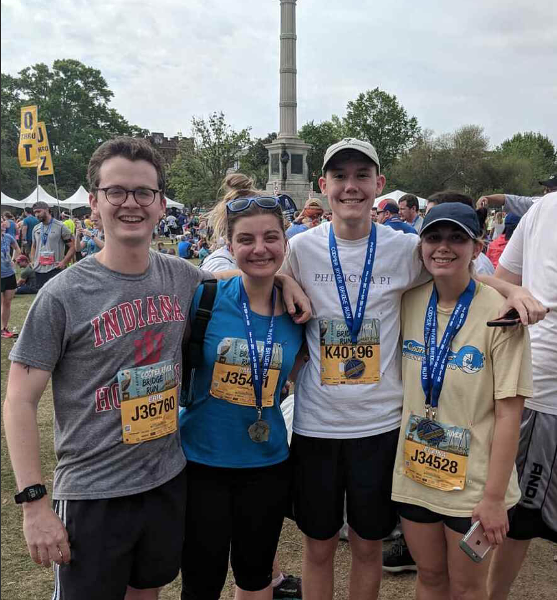

import '../../../src/components/fontawesome'
import { FontAwesomeIcon } from '@fortawesome/react-fontawesome'

<FontAwesomeIcon icon={['fas', 'star']} size="lg"/>
<FontAwesomeIcon icon={['fas', 'star']} size="lg"/>
<FontAwesomeIcon icon={['fas', 'star']} size="lg"/>
<FontAwesomeIcon icon={['fas', 'star']} size="lg"/>
<FontAwesomeIcon icon={['fas', 'star']} size="lg"/>

### Summary
The Cooper River Bridge Run is a **10K race** that takes place in **Charleston, SC.** 
It's probably one of the biggest 10Ks in the U.S. It starts on Coleman Blvd. in Mt. Pleasant, SC
and you cross the famous Ravenel Bridge (formerly known as the Cooper River Bridge) onto King St. and then you take Meeting St. to the finish line next to Marion Square!
You can sign up through regular registration or [fundraise for certain charities listed here.](https://bridgerun.com/charity-connections/)

[If you liked this review or found it helpful, you can like it on BibRave.](https://www.bibrave.com/races/cooper-river-bridge-run-10k-reviews/13996)

[To learn more about the race beyond this review or to sign up, visit the race website.](https://www.ccprc.com/1391/Mullet-Haul-Trail-Run)

### Overall
So I may be a bit biased since this was my first race ever, but it's still the most fun race experience I've had. The whole city is focused on this race for the weekend, so there are events all around the city dedicated to it. There's also live music along the course and a great hype man at the start while you're waiting really long in your corral. Once you're off the bridge the crowd support is phenomenal. If you're looking for a great first race or first 10K, this is a great one in a beautiful destination.

### T-Shirts/SWAG
Oh my gosh there is so much free swag at the expo. I even got free sunglasses from Dunkin Donuts on the morning of the race. I'll admit though that the T-Shirts most years are pretty terrible in terms of design and just regular shirt material. You also get a sweat towel which comes in handy if you run or play sports in the summer. I also loved the medal that year because it was sparkly!

### Aid Stations
I remember there being a good amount of aid stations along the course. There are even "aid stations" before the race even starts. I put this in air quotes because I don't think it's race sanctioned, just the businesses on Coleman Blvd. being awesome! At the end of the race there's a big runner's village set up in Marion Square with lots of free powerade and bananas although the lines are long. Look for the fun after parties in the area to go celebrate!

### Course Scenery
Charleston is beautiful! The race starts in Mt. Pleasant on Coleman which is a great street there and then you hit the bridge getting an awesome view. Once you're off the bridge, it's down Meeting to King St. where the course narrows but is one of the most popular streets in Charleston. There's some brick on the street that's hard to run on, but it's still beautiful.

### Expo Quality
Great expo with events throughout the weekend. There are tons of vendors giving away free stuff and there are cheap throwaway clothes available.

### Elevation Difficulty
The only elevation is going up the bridge for a short period of time and then you go downhill! Other than that it's extremely flat.

### Parking/Access
So if you're staying downtown, there are buses that will take you to Mt. Pleasant for the start. At the time, I lived right down the street from the buses so it was no problem but if you are planning to park somewhere, parking in Charleston is always a drag with or without a major race going on.

### Race Management
I thought the race was very well-organized especially considering the number of people who run it! I liked the amount of communication about the bridge run, and they make sure to update you about future bridge run events in the future.

### Conclusion
This is a great destination race, and since it's so massive, you get the benefit of having lots of events catering to the race. If big crowds overwhelm you, probably best to avoid, but if that gets you pumped, this one can't be missed. Also make sure you have a good plan about getting transportation to the start. If you can avoid driving and parking, please do so. You also get to enjoy more post-race drinks that way! Overall, this is such a fun race with great crowd support, awesome parties, and a beautiful location. What more can you ask for?
