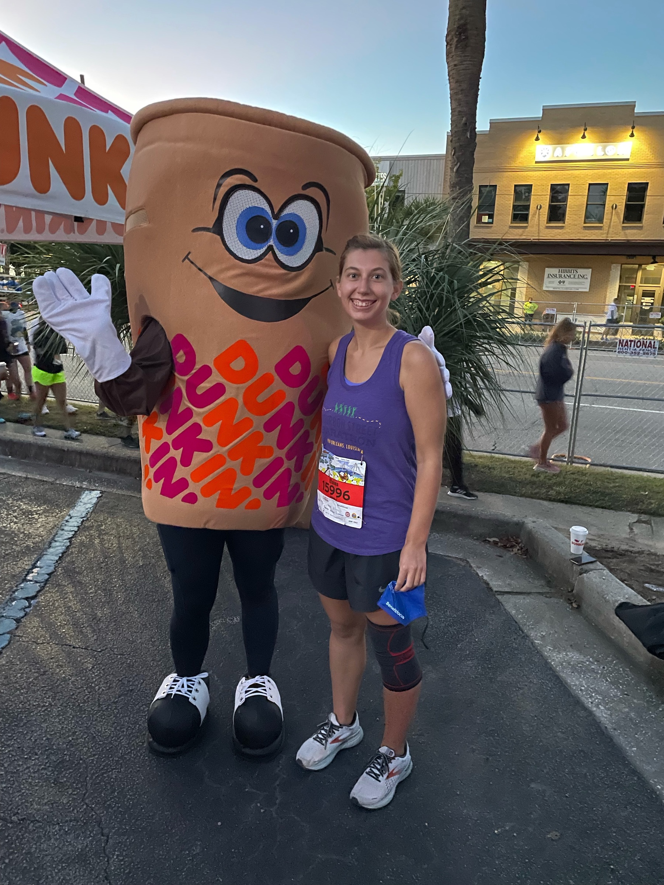

import '../../../src/components/fontawesome'
import { FontAwesomeIcon } from '@fortawesome/react-fontawesome'
import CooperExpoCarousel from "./CooperExpoCarousel";
import CooperCorralCarousel from "./CooperCorralCarousel";
import CooperSwagCarousel from "./CooperSwagCarousel";
import DunkinVideo from "./DunkinVideo";

<FontAwesomeIcon icon={['fas', 'star']} size="lg"/>
<FontAwesomeIcon icon={['fas', 'star']} size="lg"/>
<FontAwesomeIcon icon={['fas', 'star']} size="lg"/>
<FontAwesomeIcon icon={['fas', 'star']} size="lg"/>
<FontAwesomeIcon icon={['fas', 'star']} size="lg"/>

### Summary
The Cooper River Bridge Run is a **10K race** that takes place in **Charleston, SC.** 
It's probably one of the biggest 10Ks in the U.S. It starts on Coleman Blvd. in Mt. Pleasant, SC
and you cross the famous Ravenel Bridge (formerly known as the Cooper River Bridge) onto King St. and then you take Meeting St. to the finish line next to Marion Square!
You can sign up through regular registration or [fundraise for certain charities listed here.](https://bridgerun.com/charity-connections/)

[This is the second time I've done this race. To see my race report for the first race in 2018, click here!](https://melted-boundary.surge.sh/race-reports/cooper-river-bridge-run-2018)

[You can also check out my BibRave review for the race in 2018 here.](https://www.bibrave.com/races/cooper-river-bridge-run-10k-reviews/13996)

There will be some duplicate info, but if it ain't broke, don't fix it!

[To learn more about the race beyond this review or to sign up, visit the race website.](https://www.ccprc.com/1391/Mullet-Haul-Trail-Run)

### Overall
While it may have lost it's magic a little bit from the first time I did the race, it's still a blast.
The whole focus for the race is this one 10K which is really rare. Most races are a weekend that are focused on a half or full marathon that happen to have a 10K option.
Therefore, if a 10K is your goal, and you are looking to go all out for your first 10K, I would highly recommend this race.

### T-Shirts/SWAG
I loved the T-shirt design this year. There's always a contest for the shirt, so you can actually vote on it every year. This year's had a monarch butterfly flying over the bridge,
which I actually saw during the race! Other than that, I believe you just got hand sanitizer and some coupons this year including one for a free commemorative gift, but you had to pick it up at a local Dick's Sporting Goods,
which I was too lazy to do. There was also a medal this year that was the same design as the T-shirt (very cute)!

<CooperSwagCarousel />

### Aid Stations
The first year I did this, there were a lot of aid stations, but this year there was only one before the bridge and two after, probably due to COVID-19. 
This was accurately relayed on the website though so I wasn't surprised, but I think others who didn't check were surprised when they got to the top of the
bridge. There were still people there to hand out emergency water bottles if you really needed one though. I can't remember if the aid stations had both water and
Powerade (or Gatorade). 

A little ways after the finish line there were free brats, water, and other snacks for your taking! The brats were past Marion Square on Meeting St. so they were pretty hidden and
the line was so short. 

Also I have to give a shoutout to my favorite unofficial pre-race aid station... Dunkin Donuts. You can buy coffee and breakfast sandwiches before the race which is great if you get there early!
We also got to take a picture with the mascot and dance since they had their own DJ.

Lots of the restaurants on Coleman Blvd. that otherwise wouldn't be open that early are and some even pass out free jello shots for people braver than me!

<DunkinVideo />

### Course Scenery
Charleston is beautiful! The race starts in Mt. Pleasant on Coleman which is a great street there and then you hit the bridge getting an awesome view. Once you're off the bridge, it's down Meeting to King St. where the course narrows but is one of the most popular streets in Charleston. There's some brick on the street that's hard to run on, but it's still beautiful.
Just like in other years, there were bands on the bridge playing music although only 2 this year. There was still a lot of music in the corrals!

<CooperCorralCarousel />

### Expo Quality
Great expo with events throughout the weekend. There are tons of vendors giving away free stuff. In the past, there were cheap throwaway clothes available, but I didn't see any this year.
There were some running shoes on sale though! I noticed this year there wasn't a lot of free swag to take home but tons of free food and drinks, which I prefer. My favorite was the Harris Teeter
table giving out free peach rings (one of my favorite candies)! 

Something different they did this year is that they had a beer garden area. Because of COVID-19, the city of Charleston wasn't allowing the free beer you normally get after the race, so you got a free drink ticket for the beer garden at the expo.
This ticket could go toward a beer, wine, or mixed drink!

My boyfriend and I also volunteered at the expo this year handing out the race bags and shirts. I've always had respect for race volunteers, but this really put into perspective how difficult it can actually be.
Because we volunteered in the afternoon until closing, we got free food and drinks from the area where you can pay to have a pasta dinner. 
Honestly, if I wasn't volunteering, I would probably pay for this because the alfredo pasta was perfect for a pre-race meal and they had plenty of beer and seltzer to indulge in!
They also had some salad and mini bundt cakes for dessert.

<CooperExpoCarousel />

### Elevation Difficulty
The only elevation is going up the bridge for a short period of time and then you go downhill! Other than that it's extremely flat. In fact I PR'ed my 10K time because most of it is downhill.

### Parking/Access
We parked at the convention center (where the expo is) and took a bus to the start line. There are also buses that will bring you back here.
I think our bus driver got a little lost on the way there but we made it in plenty of time.

There are also other buses downtown and in Mt. Pleasant. 

### Race Management
I thought the race was very well-organized especially considering the number of people who run it! I liked the amount of communication about the bridge run, and they make sure to update you about future bridge run events in the future.
With COVID-19, running a massive race like this is even trickier, but I think they adjusted well. I felt safe since they required a proof of vaccination or negative test. The only thing I didn't like was that masks weren't really enforced
in the corrals which tend to get tightly packed as you move closer to the start line. But, once we started running, I felt it was easy to remain distant from people. There were less people running the race this year so bottlenecks weren't as much of a problem as the first time I did the race.

### Post Race Shenanigans
After the race, there are tents with some more vendors, food, and drinks set up in Marion Square. There's also a band there so it's a great spot to celebrate finishing the race.

Usually I would stick around for a while, but it was just way too crowded, so we hit up our usual post-race spot at the East Bay Biergarten which has a party for the Bridge Run. You don't have to be a runner to attend, and I highly recommend going! They have some alcohol vendors there and we got free Moscow Mules. 
You can order food too and everything is well organized. We got some free swag here as well! Doors opened at 10. Don't forget to bring your ID!

### Conclusion
This is a great destination race, and since it's so massive, you get the benefit of having lots of events catering to the race. If big crowds overwhelm you, probably best to avoid, but if that gets you pumped, this one can't be missed. 
Overall, this is such a fun race with great crowd support, awesome parties, and a beautiful location. What more can you ask for?