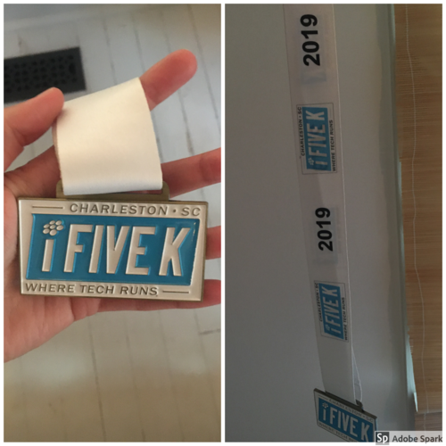

import '../../../src/components/fontawesome'
import { FontAwesomeIcon } from '@fortawesome/react-fontawesome'

<FontAwesomeIcon icon={['fas', 'star']} size="lg"/>
<FontAwesomeIcon icon={['fas', 'star']} size="lg"/>
<FontAwesomeIcon icon={['fas', 'star']} size="lg"/>
<FontAwesomeIcon icon={['fas', 'star']} size="lg"/>
<FontAwesomeIcon icon={['far', 'star']} size="lg"/>

### Summary
The i5k is a **5K race** that takes place in **North Charleston, SC.** 
It's a down and back starting at Riverfront Park. The race is a networking event for the Charleston tech community, with proceeds going toward the Charleston Digital Corridor's talent strategy. 
However, you do not need to be a part of or work for a tech company to participate.
[If you liked this review or found it helpful, you can like it on BibRave.](https://www.bibrave.com/races/charleston-i5k-reviews/14000)

[To learn more about the race beyond this review or to sign up, visit the race website.](https://www.ifivek.com/)

### Overall
So I think it's worth noting that I work at one of the companies that pays for my race entry. Like another reviewer mentioned the i5K is a race that anyone can participate in but it's kinda more about the big tech companies racing each other to try and get bragging rights. If you're running this race to try and PR, I wouldn't because there are a lot of walkers and people who don't do a lot of races and don't know how to self corral haha, which is fine but just something to know going in. So to me this race gets high marks because it's easy, free (for me), I get to run with a bunch of my friends, and the after party is one of the best.

### T-Shirts/SWAG

There's no shirt from the event itself. Each tech company has a theme, like one year we did Nintendo, and they have shirts to reflect that. I'm not sure if you only get the swag bag if you're from one of the tech companies participating, but I got a couple of reusable straws, sunglasses, coozies, a cooling off towel, etc. So it's a pretty good swag bag. You also get a medal at the end.

### Aid Stations
There is one aid station halfway like most 5Ks and at the end there's a ton of pizza and beer and a DJ!!

### Course Scenery
It's at Riverfront Park in N. Charleston so there are some nice parts, but otherwise just boring road that's an out and back. It's very flat so after you pass the walkers, you can move pretty fast.

### Expo Quality
No expo for me.

### Elevation Difficulty
The course is veerrryyy flat.

### Parking/Access
The race is on a weekday so you have to deal with lots and lots of traffic!! You also have to walk a bit to get to the start area.

### Race Management
It's hard to say because each company is the one really communicating and handing out materials. So, I can only speak to what I saw on race day. The water station is very light but I didn't hear of anyone not getting water. The after party is awesome so that's really well organized. The only thing I don't like is that the lines for pizzas and beer get very long because there are so many racers. Also, they don't limit the number of pizzas and beer so if you finish later, you might not get any. Like someone else mentioned too there are people who bib swap because it's not a serious race and because it's on a weekday with employees from the tech companies, they may end up having a problem at work or a last minute meeting pop up and give it to a coworker. In that case sometimes a guy will win a women's age group award. As far as I know though, this all works itself out.

### Conclusion
I wouldn't recommend this race to a friend unless they work for one of the companies. I would tell them to just join me at the after party afterwards. Because the company really handles everything for you, not only is it free that way, but it makes the competition more fun if you're a part of one of the companies. What is really recommendable isn't the race but the after party which I'm pretty sure it's open to everyone!