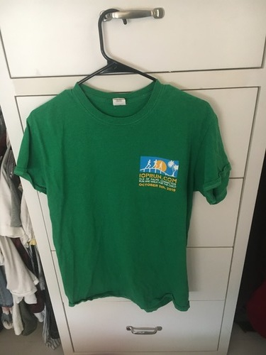

import '../../../src/components/fontawesome'
import { FontAwesomeIcon } from '@fortawesome/react-fontawesome'

<FontAwesomeIcon icon={['fas', 'star']} size="lg"/>
<FontAwesomeIcon icon={['fas', 'star']} size="lg"/>
<FontAwesomeIcon icon={['fas', 'star']} size="lg"/>
<FontAwesomeIcon icon={['fas', 'star']} size="lg"/>
<FontAwesomeIcon icon={['far', 'star']} size="lg"/>

### Summary
The Isle of Palms (IOP) Connector run is a **10K race with a 5K option** that takes place in **Isle of Palms, SC.** 
It's a down and back across the bridge that connects IOP to Mount Pleasant. 
According to the race website the, "race has donated over $1,000,000 to local nonprofits working to heal the children and families of the Lowcountry that have been harmed by child abuse." 
This race report is about the 10K.

[If you liked this review or found it helpful, you can like it on BibRave.](https://www.bibrave.com/races/iop-connector-run-reviews/14012)

[To learn more about the race beyond this review or to sign up, visit the race website.](https://www.ioprun.com/)

### Overall
I did this race to get a last minute proof of time for another race and I was not disappointed. Even though it started raining, the wonderful cheerful volunteers and beautiful scenery really got me through the race. Loved being able to infinitely fill up my beer at the after party.

### T-Shirts/SWAG

You get a t-shirt which was kinda generic, some pretty good coupons, magnets, stickets, etc. I am attaching a picture of the shirt. No medal.

### Aid Stations
I was actually surprised with the large number of aid stations. Because it was both a 5K and a 10K, you not only got your 10K water stations, but the 5K water stations as well. I never felt dehydrated! The volunteers were great too.

### Course Scenery
IOP is beautiful and you get to see the beautiful creeks the connector goes over. It is still a bridge run though so it isn't like there's a ton of variety.

### Expo Quality
No expo, but there were some vendors at the finish area. There is also bib pickup ahead of time as well as day-of-race.

### Elevation Difficulty
It is a bridge run so there are some hills but I want to say there's no more than 4 and they aren't that bad! I'm a huge baby when it comes to any kind of elevation since I've only lived in flat areas, so if I think it's not too bad, you probably won't either. Still, it's enough of a challenge to make you feel accomplished.

### Parking/Access
We had no problems parking as parking was communicated very clearly. It wasn't too far from the start either.
Because it was so early too, the lot was pretty much exclusively runners. 

### Race Management
Overall, it was well-managed. There were lots of portapotties and the ability to pickup your bib and swag ahead of time. There were ample aid stations and a great after party with music, some food, and unlimited beer. The instructions on how to get there and what time the connector would close down was communicated very well too. The only thing that wasn't communicated well was the food situation.
It was said there would be free sausage after the race but it was really the local fire station volunteering to grill some small bites, so I was expecting a big brat instead of a small piece of sausage. It was incredibly kind of them to do that though!! Otherwise, there were bagels and bananas you could snack on. I just wish they didn't make it seem like you were getting a free meal afterward.

### Conclusion
I would definitley recommend this race especially if you don't normally get to do hill training. It can be hard to fit elevation into your training in Charleston and this is a great way to do just that without crushing your legs. The amount of aid stations and awesome volunteers makes it a very pleasant run as well. It's also for a great cause.
