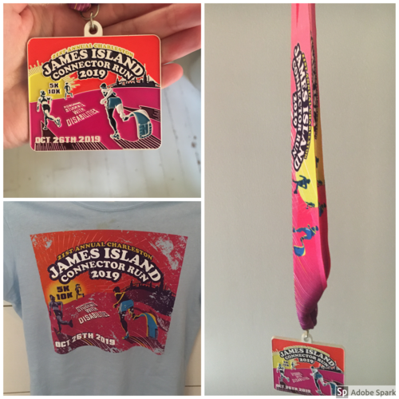

import '../../../src/components/fontawesome';
import { FontAwesomeIcon } from '@fortawesome/react-fontawesome';

<FontAwesomeIcon icon={['fas', 'star']} size="lg"/>
<FontAwesomeIcon icon={['fas', 'star']} size="lg"/>
<FontAwesomeIcon icon={['fas', 'star']} size="lg"/>
<FontAwesomeIcon icon={'star-half-alt'} size="lg"/>
<FontAwesomeIcon icon={['far', 'star']} size="lg"/>

### Summary
This race report is for the James Island Connector **10K**, which takes place in **Charleston, SC**. There is also a **5K option.**
The course is a down and back starting/finishing at Cannon Park after crossing the James Island Connector.
According to the race website, "Proceeds from the Charleston James Island Connector Run benefit the Gavalas Kolanko Foundation, a local charity that awards annual scholarships to students with physical disabilities making “Education Within Reach” for South Carolina undergraduates pursuing a college education despite physical limitations."

[If you liked this review or found it helpful, you can like it on BibRave.](https://www.bibrave.com/races/charleston-james-island-connector-run-reviews/14015)

[To learn more about the race beyond this review or to sign up, visit the race website.](https://jicrun.com/)

### Overall
So as most of you probably know... Charleston is very flat. We have a couple of other bridge runs like the IOP Connector and the famous Cooper River Bridge Run. This one is way harder in my opinion than both of those. If you are looking for a challenging 10K in the Charleston area, this is your best bet. It's not impossible though! I'm not the best runner by a long shot and I was able to get through it. There's just no shade so bring sunglasses! The sun will be staring at you in the face. The after party makes the challenge soooo worth it. One of my favorite post-race parties.

### T-Shirts/SWAG

So I didn't like the shirt because it ran too small especially in the armpit area, but I liked the color. The material is not good for running though in my opinion. Something that is awesome though is how inclusive the design is representing those who are differently abled. The medal has the same design as the shirt and I like it a lot more on the medal than the shirt.

### Aid Stations
I think there weren't enough aid stations or rather I didn't train for that number of aid stations. It was fewer than I was used to.
I want to say there was one at 1.5 miles and another at 4 miles. The volunteers were great though!
There's also a portapotty halfway which is awesome!!

### Course Scenery
The scenery is pretty nice but nothing compared to IOP Connector and the Cooper River Bridge Run. 
It ends in Cannon Park which is a great area for an after party, and you can explore downtown.

### Expo Quality
No expo, but there are vendors at the start/finish area. We didn't take a good look at who was there, but it was a good amount for a smaller race.

### Elevation Difficulty
I think elevation-wise, it is the most difficult you will encounter in Charleston. I felt there were around 5 hills.

### Parking/Access
There's a few garages nearby you can park at, but I would try to find a meter on Rutledge instead. Parking downtown is no fun haha.

### Race Management
I thought the race was managed very well especially for starting and finishing in downtown Charleston. That must've been hard to pull off. The after party was very well organized. Despite lots of runners, the beer line wasn't long and they had more than enough hot dogs to scarf down!! The only thing that wasn't very organized was the check-in process. That's when you get your shirt and bib and the lines were confusing. They didn't have signs saying which line you should be in for which bib number. Instead one volunteer just yelled it out every so often. Also, you'll have to walk all the way back to where you parked to put your swag away.

### Conclusion
I would recommend this race for anyone looking for a good challenge and medal that really feels like you earned it. The after party was filled with fantastic food and drink and we met a lot of new people in the running community.