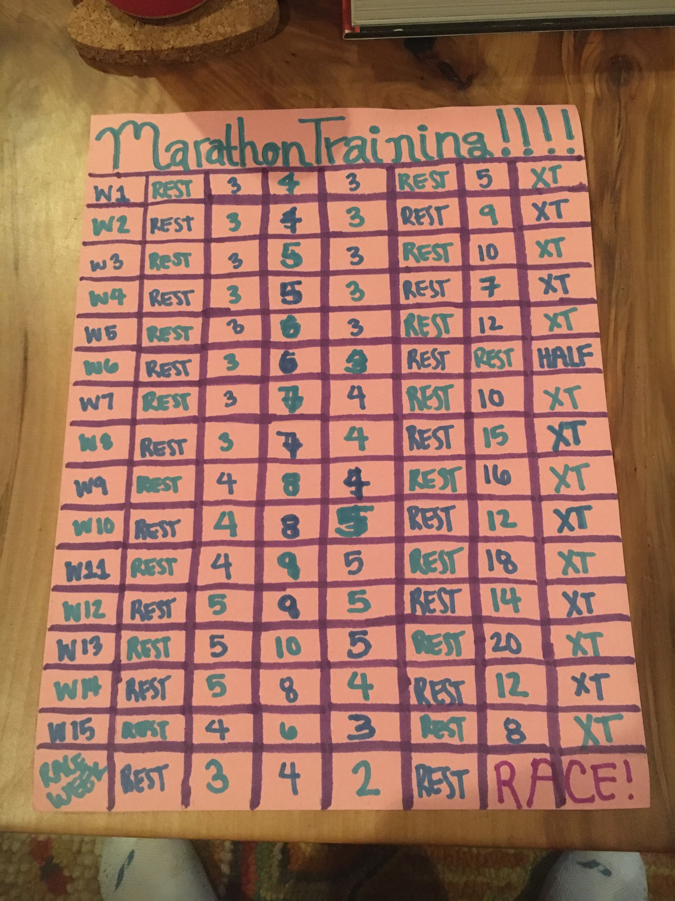

I'm excited to announce that I have signed up for my first marathon! Due to COVID-19, I haven't done an in-person race
since last Februrary. After the Beaufort Twilight Run was (rightly so) cancelled, I just stuck to virtual races
like a good quarantiner. Now that we know just how effective masks are and that non-crowded outdoor activities are pretty safe,
I felt comfortable starting to look for a race to run in person. 

### So what was my criteria?

1. Find a race that falls in line with my training plan. 
2. It must be drivable. I don't want to fly during a pandemic unless it's an emergency.
3. If I have to stay overnight, it must have clean, private accomodations available, such as some kind of campground or AirBnB. 
4. The race directors are taking all of the right precautions to ensure a SAFE race, such as requiring masks in the start and finish areas.
5. The number of people running will likely be small. 

And guess what? I found the perfect race. It will only be a 3 hour drive. 
The day of the race is the exact last day of my training plan.
I e-mailed the race directors and looked at their Facebook page for a race they recently held and they are following safety precautions.
Last year only about 220 people ran the race, so assuming around the same number of people this year, the corrals shouldn't be crowded.
Lastly, we found the perfect AirBnB 5 minutes from the start line that is "enhanced clean" certified.

### My Training Plan
[I am using Hal Higdon's Novice 1 Training Plan.](https://www.halhigdon.com/training-programs/marathon-training/novice-1-marathon/)
I used his 10 mile training plan after I kind of struggled to stay in half marathon shape this summer and it worked super well for me.
It just so happened that I already had done the first two weeks of the training plan, so I decided to start on week 3.
His website has so many different plans for various levels and distances. For the marathon alone, he has 14 different plans, so it's easy to find the right one for you.

I even wrote mine out for fun and yes I messed up a bit, but I still think it came out cute :)

For cross-training, I'm mainly going to do strength training. So far, I've done the following workout:
1. 20 squats
2. 10 forward lunges (each leg)
3. 10 side lunges (each leg)
4. 20 jump squats
5. 20 pulsing lunges (each leg)
6. 20 leg lifts
7. 60 second bridge
8. 20 bridge lifts
9. 10 one leg bridge lifts (each leg)
10. 60 second plank
11. 20 clamshells (each side)
12. 20 body weight leg extensions [(since I don't have a machine)](https://www.youtube.com/watch?v=tt2fizr_trw)
13. 20 superman lifts
14. 30 second superman hold
15. 20 single leg squats (each leg)
16. 10-12 dumbbell curls
17. 10-12 dumbbell shoulder presses
18. 10-12 dumbbell forward extensions

I usually add a 1-1.5 mile walk into the cross-training day too. On days I'm especially sore, I'll probaly end up doing some yoga with strengthening poses.
My goal with the workout above is to increase the reps as I get better at it. For example, with the dumbbell exercises, I want to get to a point where I can repeat those 3 times each.
For the timed portions, it would be great to be able to hold those for longer.

### My Goals

My main goal is to finish. Just finish within the 7 hour timeframe. 
My stretch goal is to finish in 5 and a half hours. That's a 12:35 min/mile pace.

I hope to keep this blog up to date with my progress and keep me honest during training!