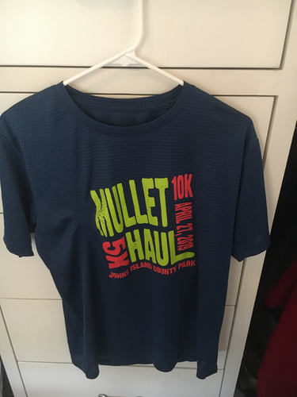

import '../../../src/components/fontawesome'
import { FontAwesomeIcon } from '@fortawesome/react-fontawesome'

<FontAwesomeIcon icon={['fas', 'star']} size="lg"/>
<FontAwesomeIcon icon={['fas', 'star']} size="lg"/>
<FontAwesomeIcon icon={['fas', 'star']} size="lg"/>
<FontAwesomeIcon icon={['fas', 'star']} size="lg"/>
<FontAwesomeIcon icon={['far', 'star']} size="lg"/>

### Summary
The Mullet Haul Trail Run is a **10K race with a 5K option** that takes place in **John's Island, SC.** 
I could be wrong but I believe the Mullet Haul Trail is a horse back riding trail, but there are no horses on this course!
Although it's a trail race, I didn't wear trail shoes and I was fine. This race report is about the 5K.

[If you liked this review or found it helpful, you can like it on BibRave.](https://www.bibrave.com/races/the-mullet-haul-trail-run-reviews/13998)

[To learn more about the race beyond this review or to sign up, visit the race website.](https://www.ccprc.com/1391/Mullet-Haul-Trail-Run)

### Overall
The Mullet Haul Trail Run is a great race for beginner trail runners. I had never done one before and thought it was cool that it had short distance options. Everyone was super friendly and the course is fun and non-intimidating. It's also great if you're looking to get an age group prize for the 5K. The 10K has a lot faster people.

### T-Shirts/SWAG

Not much in the form of SWAG but the material of the T-Shirt is awesome! I included it in a picture. My boyfriend won an age group prize, but never picked it up but I think the prizes were actually cool pint glasses.

### Aid Stations
Like most 5Ks, there's one water station at halfway and some cheering fans volunteering. There were more than enough drinks and snacks at the end of the race and because of the area there are lots of picnic benches and area to spread out. They also had a PT station helping people do post race stretches!

### Course Scenery
The trail doesn't have much scenery. Mostly trees and since it's a horse trail, there's some poop you have to watch out for, but you'll smell it before you step in it haha. It's nicely shaded most of the time until the end where you run through a big field.

### Expo Quality
There wasn't an expo before but there were actually some vendors at the race you could talk to which I thought was cool for a small local race.

### Elevation Difficulty
It is flat but it's different terrain if you're used to a road race. I used road shoes and was fine and actually liked the spongey feel of an almost sawdust like terrain. The end though has you running through a big grass field and that was kinda hard to be honest.

### Parking/Access
Plenty of parking and close to the start line. We were running late because my boyfriend plugged in the wrong address the night before so we thought we had more time. 5 minutes to start, we parked, grabbed our bibs, and walked to the finish line with time to spare.

### Race Management
Everything ran smoothly on race day. Like I mentioned in Parking, we were late and our bibs were given to us quickly and we were signed in very quickly as well. They even held our shirts for us so we could pick them up after. The people checking us in were very nice and joked with us about our lack of punctuality. They were great! The trail was also clearly marked and there were enough volunteers helping to make sure you were going the right way. I almost went the 10K route and a volunteer was quick to make sure I didn't subject myself to that.

### Conclusion
I would definitely recommend this race to a friend, especially one that is looking for more trail runs in the Charleston area. It's low key without a ton of people but enough energy to have a great time. Despite not a big race, I felt cheered on by volunteers and fellow runners. It's also very shaded on the trail, which is greatly appreciated in Charleston. I think more people sign up for the 10K, so if you're doing the 5K, you have a pretty good chance of placing in your age group. I will definitely sign up again :) and hopefully be on time...