import '../../../src/components/fontawesome';
import { FontAwesomeIcon } from '@fortawesome/react-fontawesome';
import FlatCarousel from "./FlatCarousel";
import PackingListCarousel from "./PackingListCarousel";
import SwagCarousel from "./SwagCarousel";
import CourseVideo from "./CourseVideo";
import FinishVideo from "./FinishVideo";

<FontAwesomeIcon icon={['fas', 'star']} size="lg"/>
<FontAwesomeIcon icon={['fas', 'star']} size="lg"/>
<FontAwesomeIcon icon={['fas', 'star']} size="lg"/>
<FontAwesomeIcon icon={['fas', 'star']} size="lg"/>
<FontAwesomeIcon icon={['far', 'star']} size="lg"/>

### Quick Summary
This race report is for the Oak Island **Marathon**, which takes place in **Oak Island, NC**, and is held by Coastal Race Productions
as a part of their Big Ass Medals (BAM!) race series. According to their race website, Coastal Race Productions, supports several non-profits in the area,
"such as the Turtle Watch Groups on all of the various Islands, Hope Harbor (our local battered women's shelter), American Heritage Girls Foundation, over 20 different local non-profit organizations as well as the Oak Island Parks & Rec."

There were also 5K, half marathon, and 1-miler (for kids) options. Each distance, except the 1-miler, also had a virtual option, but I'm not sure if that's always the case or if they only offered that due to COVID-19.

This was my first ever marathon and I learned a lot along the way, but I will say I probably learned the most starting at mile 18 (more on that later).
I ended up finishing which was my main goal. I had a stretch goal of 5:30, which during training I realized should probably be 5:45. I ended up finishing in 6:15
due to some mistakes I'll get into later... hence the lessons learned. 

[If you liked this review or found it helpful, you can like it on BibRave.](https://www.bibrave.com/races/run-oak-island-2021-reviews/14833)

[To learn more about the race beyond this review or to sign up, visit the race website.](https://coastalraceproductions.com/race/run-oak-island/)

[To find out more about why I chose this race, check out my marathon announcement.](http://melted-boundary.surge.sh/running/marathon-announcement)

### Preparation

Oak Island is only about a 3 hour drive for us, but since the race starts at 6:45 AM and there was no same-day packet pickup, we spent the night before the race in Oak Island.
[We stayed at this AirBnB](https://www.airbnb.com/rooms/43882008?source_impression_id=p3_1614044914_w7uVvu2G0A9dSlG%2B&guests=1&adults=1),
which was great! It was only a 5 minute drive from the start area and we got a mother-in-law suite to ourselves. There were also snacks and 
drinks like iced tea and Gatorade provided. The only thing it didn't have was a stove, oven, or toaster, so if you wanted to cook your food
for dinner, it probably isn't the place for you. It did have a Keurig, fridge, and utensils. The TV also had Netflix available for use. 
Something to keep in mind when looking for a place is that it definitely seemed like there were more
shops and food on the eastern side of the island. We were just west of the middle so we still felt close to everything, but further west we might not have felt that way. 

Before checking in though, we headed to the packet pick-up which was held at the race start and finish area in Middleton Park. 
Pick-up was simple. Just have your bib number handy, tell them, and you get your bib. 

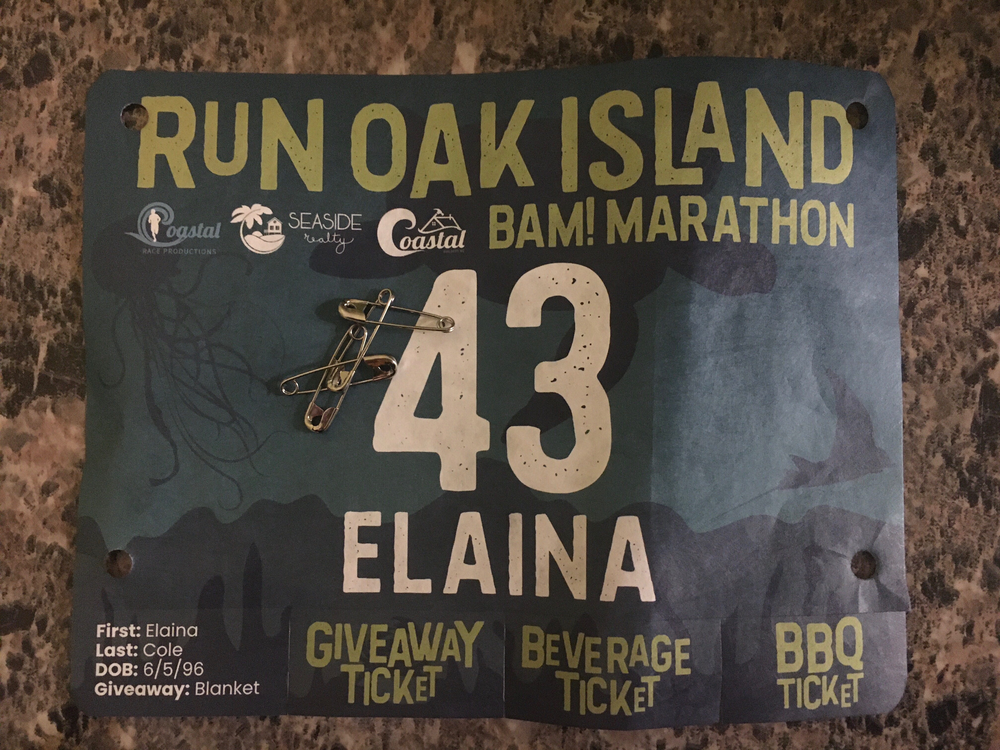

If you ordered a T-Shirt, this is where they gave it to you as well. Also, there is a giveaway item for each race. This one's was a fleece blanket. However, due to
the pandemic, the order was unfortunately delayed. They shipped them to everyone once they arrived, but we didn't mind waiting. We were just happy to run!
Normally, I think Fleet Feet would be out there too selling fuel, but the weather was horrible, so I don't blame them for not being there the whole time. 

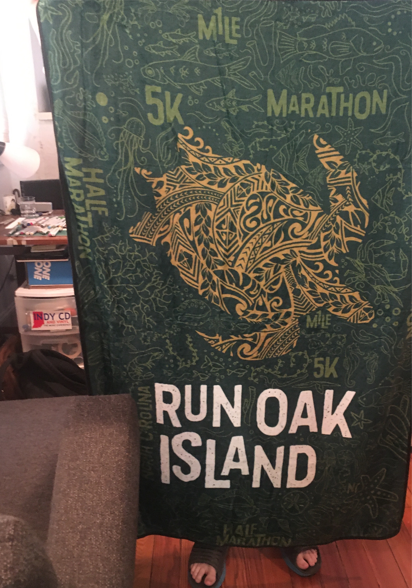

After pick-up, we checked into our AirBnB, and immediately started thinking about food. We narrowed our options down to 2 places,
[Island Way](https://islandwayres.com/) and [Kai-Joe's](https://www.facebook.com/OakIsland48th/), since both had curbside pickup options.
We settled on Island Way, since it was a lot closer and had more simple carb-heavy foods. Although it was more expensive and the food was so-so. I got the lobster
ravioli and Eric had the chicken alfredo. I wish we could've tried Kai-Joe's because I've never had Hawaiian style tacos, but my stomach would've been yelling at me the next day. 

As much as I wanted to keep thinking about food, I had to think about the race, namely what was I going to where. 
The weather forecast kept changing throughout the week. At one point, there was even a possibility of snow. It ended up being 37 and raining,
so I'm glad I overpacked a variety of clothes to choose from.

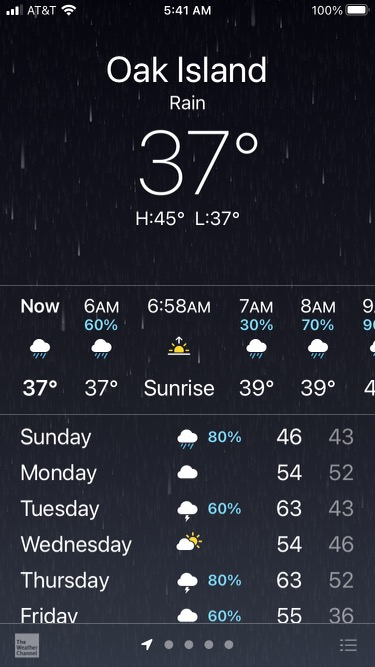

I ended up wearing the following:
1. Nike running cap
2. Cotopaxi mask
3. Nike sports bra
4. Golden Tracksmith turtleneck
5. Merrell rain jacket
6. Arcter'yx leggings
7. Nike shorts with zipper pocket in the back
8. Nathan running vest
9. Knee compression sleeve
10. Balega Enduro quarter socks
11. Brooks Adrenaline 21 shoes
12. Tracksmith gloves
13. Garmin Forerunner 35 watch
14. MY BIB!!!

I got a nice and neat picture and then the next morning I got a "flat" photo or at least I tried!!

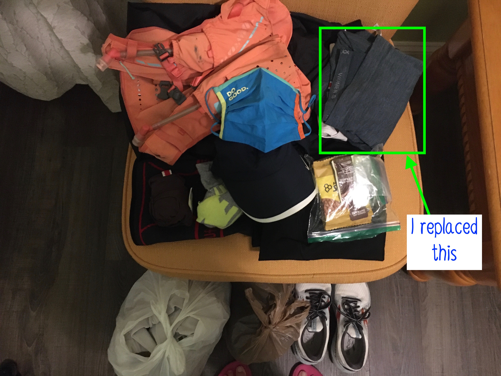

I also had the following prepared for race day:
1. Portable phone charger
2. Honey Stinger waffles opened and cut in half in ziploc bags
3. One chocolate Gu
4. Ziploc bags to keep my phone and charger dry
5. A change of clothes, towel, protein bar, full water bottle, and Gatorade for after the race

<FlatCarousel />

**Below are our full packing lists. You can tell who is the more Type A one! I would say it was a great list, but there were two things I wish I added to mine:**
**an extra pair of contacts and an extra pair of gloves (more on that later).**

<PackingListCarousel />

I know that sounds like a lot but it was still too early to go to bed, so we watched Ink Master on Netflix to get a healthy dose of
trash competition reality TV while we played Sagrada. We also brought our new favorite board game Parks, but after I was victorious
in Sagrada, we went to bed. 

### Morning of the Race

We woke up at 5:15 AM after struggling to sleep the night before. Apparently not being able to sleep before a big race is very common. The day before my first half marathon during
WDW Marathon Weekend, we went spent the day at Universal Studios so I didn't experience the same inability to sleep. I was still so excited though that it was pretty easy to wake up.
First thing I tried to do was put my contacts in which was a bad idea because my eyes weren't fully prepared to be punctured by my finger. I ended up losing a contact, causing me to panic.
Luckily Eric found it, but it was a nice reminder to always pack an extra pair. Next, I made my favorite pre-long run breakfast: plain bagel, peanut butter, and banana. 
After changing into my running clothes, we had to throw everything back in the car because we would still be running during check out. 

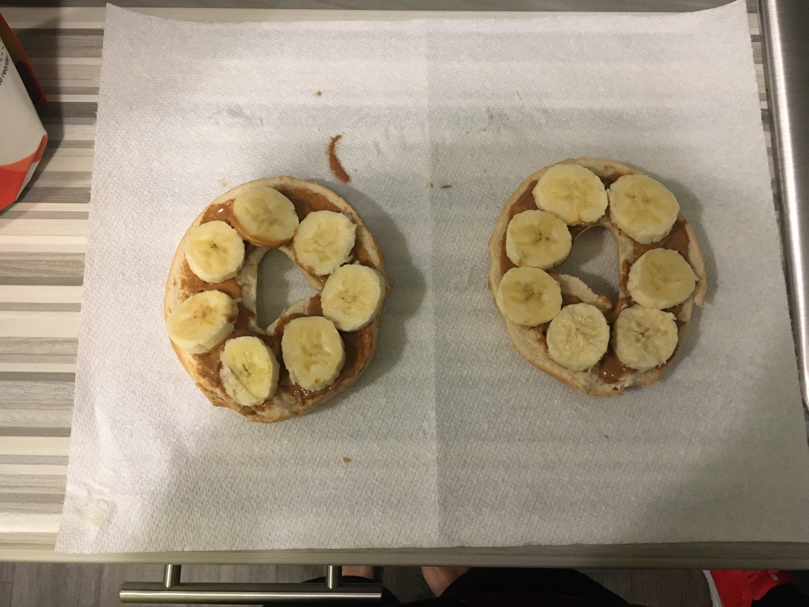

### Parking 

We left our AirBnB around 6:15 and got to the start area in about 5 minutes. Unfortunately, parking seemed very limited. With only 15 minutes to race start, 
we definitely left a little too late. We lucked out though. Right behind the ampitheater in Middleton Park, where you pick up your packet, there was a spot marked as
"Town Bus Parking Only." With no other spots that seemed readily available, we just took it on the off-chance it was fine. We asked one of the race directors and they said that was
totally cool since they had the entire lot booked for the race. She even said that she would keep an eye on it and make sure no one towed us. Even though it's a smaller race, that
doesn't mean you can roll up at the last minute and we were very lucky people assumed that spot was unavailable. 

### Corrals

Due to COVID-19, you were required to wear masks in the starting area and had to maintain some distance from others. There was also a rolling start for the marathon from 6:45-7:00,
and you could only start lining up 10 minutes before start time. There weren't any designated corrals, so you just had to self-corral in a roped off queue. People completely ignored this line. It was quite frustrating for myself and others who had followed the rules.
We were some of the first people in line and ended up starting pretty much last. I'm going to give them the benefit of the doubt and say they had no idea they were supposed to line up in the roped off areas
because they could've been more clearly marked, but because it was such a small race I didn't mind. Because of all the rain though, most of the starting line was flooded,
so there was a pretty big bottleneck at the beginning as some people walked single file across the start line. I didn't even realize we crossed it so I started my watch late. 
The race photographer actually caught this moment perfectly (see Eric and I below):

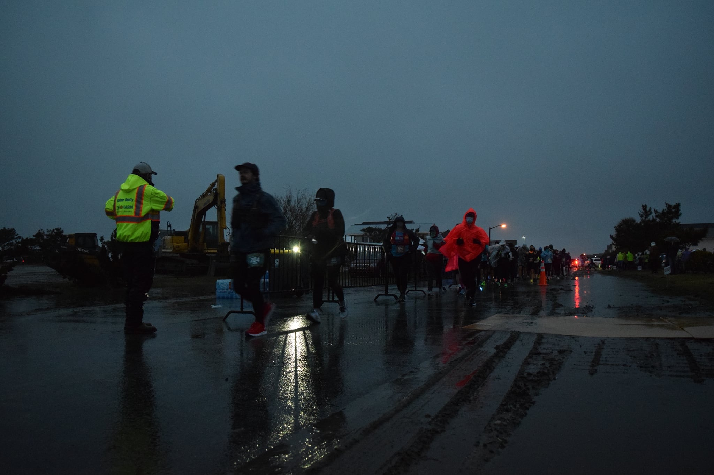

### The Race

Now the moment you've all been waiting for! I mean it's a marathon, not a sprint right? I was just trying to reflect that in my writing. 
After spreading out a little bit from other runners, I decided to take my mask off. The first part of the race went through more of the neighborhood area of the island, and I got to see some pretty houses
when I wasn't looking down trying to avoid puddles. 

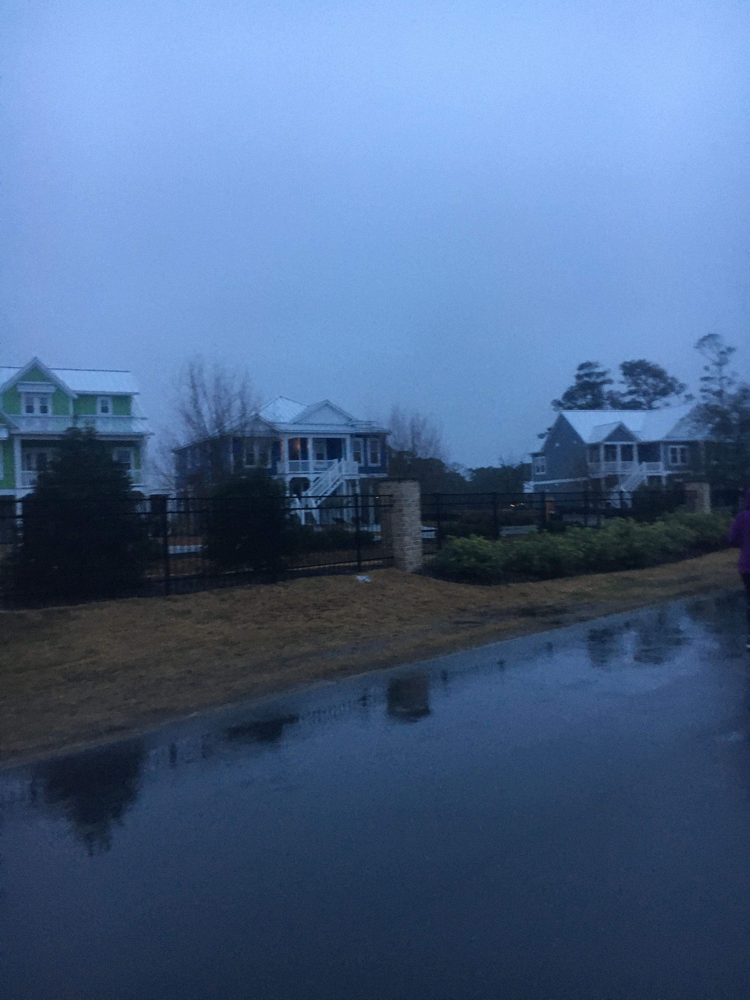

Around mile 5, we broke away from the half-marathoners to do a little loop only to rejoin them on our way to the lighthouse. At this point,
I had to take my gloves off because they got wet from the rain and, therefore, were making my hands colder. This is the part where having extra gloves would have come in handy (pun intended).
I love my Tracksmith gloves, but I hadn't used them in the rain before, and they aren't really meant for that weather. At least there was some music in this section to keep the adrenaline going.

<CourseVideo />

The lighthouse was around mile 9 and was motivational to see since it's featured on the medal. After the lighthouse, you turn around and go back down the road, break away from the half marathon again,
and unfortunately have to run on sidewalk.

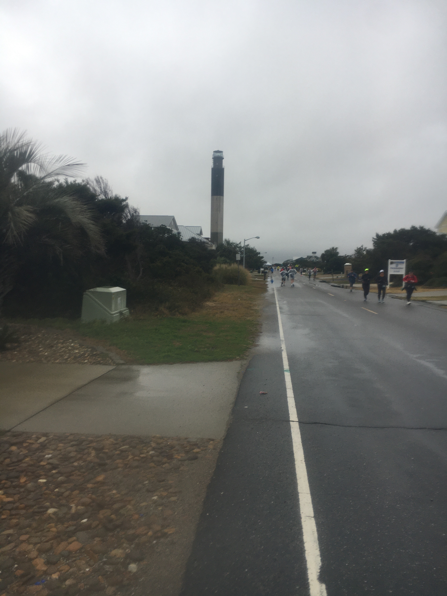

This was one of my least favorite parts of the race because the sidewalk was kind of jagged (running in Charleston, I'm used to it)
and parts had some pretty bad puddles so I ended up having to weave into some parking lots to get around it.
I do know that the race directors had to change the marathon course last minute because an entire section was flooded (see below), so I wonder if that was originally a part of the course.

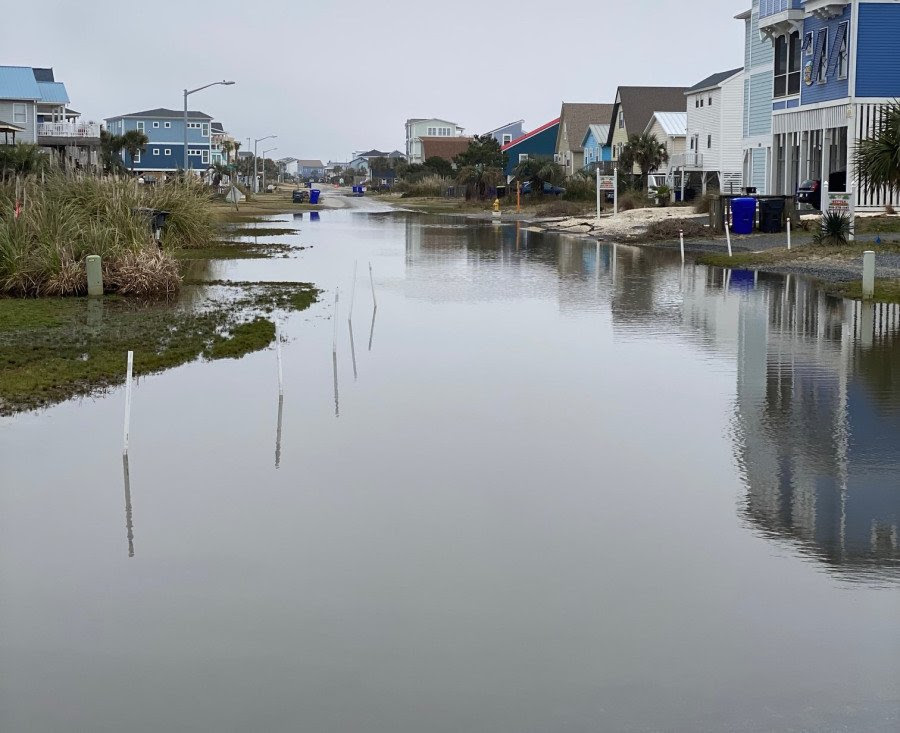

This lasted until about mile 13 and we rejoined the half-marathoners yet again. However, the half marathon course's mile 13 is the marathon course's mile 15. 
I was running with someone doing the half, and she was trying to be encouraging telling me "we're almost there!" When I asked her if she meant almost to mile 15, it clicked for both of us that 
we were doing different races. What's especially cruel in this spot of the race is that you can hear the finish area with people celebrating with their music, beer, and BBQ! Not cool!
However, you actually do get to see the beach on this stretch through mile 18/19, and that is cool!

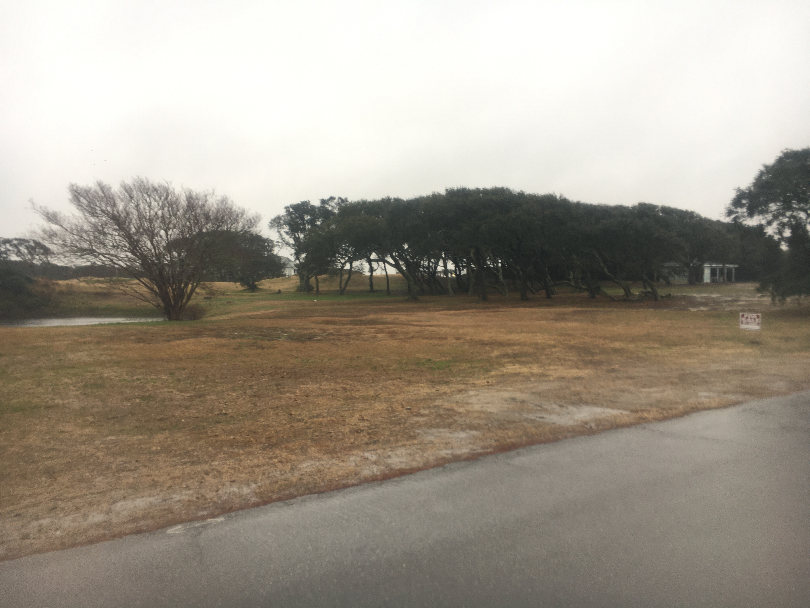

After passing mile 15, I started to get pretty emotional. The next 5 miles of the race were just straight down the same road and I felt all by myself since
no one else was running around me at this point. Because of the weather and COVID, there weren't any spectators either. 
Despite not having the usual crowd support, however, the race directors did a great job making a bunch of cute signs along the course to keep you motivated.

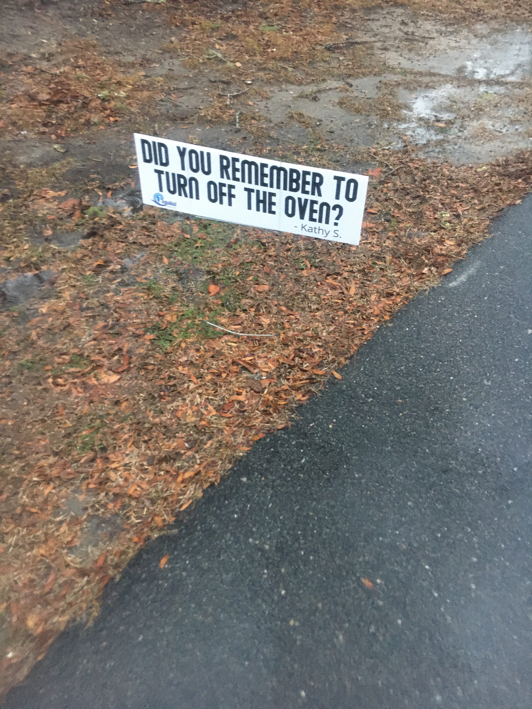

It did help, but I still couldn't zone out like I normally can on a run. I didn't want to wear my headphones because of the rain 
and the roads not being closed to traffic. I just felt alone, in pain, and unable to distract myself from those thoughts.

At mile 18, I just really hit the wall. My hands were freezing and my feet were constantly wet and cold. My Balega Enduro 
quarter socks were great for the weather but chunks of the roads would be submerged and pretty unavoidable. I swear as soon as my feet would dry off after stomping through a puddle,
I would just step through another one. I was balling crying, making it hard to breathe. I just wanted to quit. Oh, and I forgot to mention, but 
my hands had completely swollen up because of... I actually don't know why... [I think this link holds the truth](https://www.mayoclinic.org/hand-swelling/expert-answers/faq-20058255#:~:text=Exercise%20increases%20blood%20flow%20to,could%20lead%20to%20hand%20swelling). So I called Eric 
because I knew he would help me get to the finish line. He is always so positive and supportive while also letting me express my emotions. 

I was still emotionally all over the place, but having Eric on the phone helped me through the mental obstacles. Once I reached mile 20,
my muscles started to feel like they were locking. I was so dumb with my fuel. Because of the weather, my Honey Stinger waffles hardened,
and I ate less than half the amount I normally do. I also ignored the Gatorade that was at the aid stations, but I definitely needed more
electrolytes. 

And then, I came upon every race director's favorite cruel joke: the biggest hill at the end of the marathon. Miles 20-23 are a down
and back on the bridge that takes you in and out of Oak Island. This is the only part of the course with any elevation, and I think
it's an inside joke amongst race directors to put their biggest/only hill at the end of their race courses. I'm not laughing. Luckily, Eric was already
done (with) his marathon, so he told me it only looked scary, but that it really wasn't that bad. He also advised me
that I should probably walk the uphill parts and jog the downhill. This was solid advice! I also liked that this part 
was a down and back because I got to see other runners ahead of me who I had talked to earlier in the race. It was fun being able to encourage each other.
One of my favorite parts of running is cheering on other runners and telling volunteers thank you!

Once I hit mile 24, I had to start walking, but I felt a lot better because I knew I would finish at this point. The end was so close, and I wanted to be able to run across the finish line, so I walked until I could see the mile 25 sign.
Then, once I hit mile 25, I would walk again until I saw the 26 mile sign. 

Finally, I could start to hear the music from the finish line!

Finally, I could see the finish line! 

Finally, I crossed the finish line! 

Finally, I can call myself a marathoner!

<FinishVideo />

### Post-race

After crossing the finish line, I was handed my gorgeous medal, and headed to the amphitheater to pick up my finisher jacket (pictured below). 
Then, I went straight for the BBQ tent. Nothing sounded better to me in that moment than a hug from Eric and some hot pork drenched in BBQ sauce. 
It was delicious!!! 

<SwagCarousel />

When asked if I was going to get my free beer, I declined, which I really regret now. But my hands were so cold, I couldn't think about holding something cold in them!
Luckily, I had my favorite whiskey waiting for me at home to celebrate!

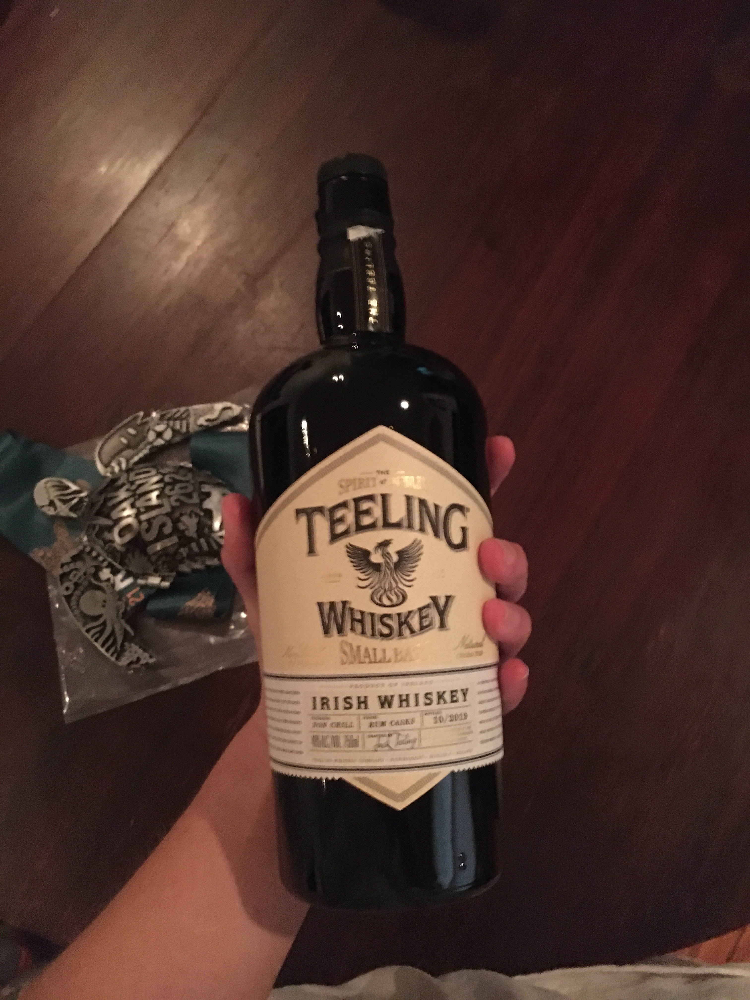

### Conclusion

I thought this was a great race, and I think it would've been even better in nice weather. The race directors had some of the best communication
I've seen from any race I've done. Almost every week they gave updates on the status of their permit to hold the event and were very clear
about the precautions they were taking to make sure people could have a safe, but still somewhat normal race, during the pandemic. They even did a 
great job of changing the course last minute when the rain caused some flooding in one section. And of course the medal is stunning! It was
definitely well-earned. Can't wait for my next marathon... maybe in 2022? Thanks for reading and stay healthy!