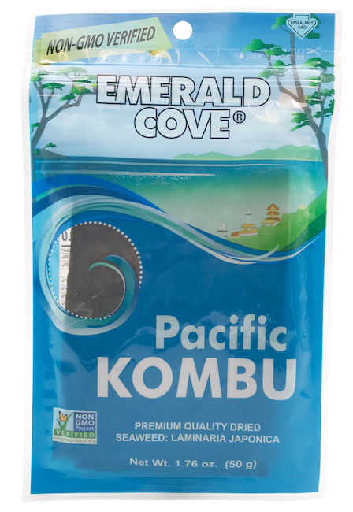

import DessertAndSakeCarousel from "./DessertAndSakeCarousel";

### What is Momofuku?

For Christmas, my little sister got me a [cookbook called Momofuku by David Chang and Peter Meehan.](https://www.google.com/books/edition/Momofuku/hPWiQZt5aRcC?hl=en&gbpv=0)
Momofuku is a noodle bar in the East Village of New York City and the books feature recipes from the chefs who opened the restaurant. 
The first recipe Eric and I attempted was the ramen, and we learned so much during the process. If you want to make the ramen,
definitely give yourself a weekend to get the ingredients, prepare the broth, and prepare the pork belly and shoulder. 

### Getting the Ingredients

#### Where to Look

We are lucky in Charleston to have [an Asian market called H&L.](https://www.facebook.com/HL-Asian-Market-155289124513164/)
If you have one in your town, definitely check it out as it's sure to have everything you need. H&L had all of the meats needed,
but I would also suggest that you check out your local butcher shop to support even more local businesses. Down the street from us
we have [a great butcher shop (with a delicious restaurant) called Herd Provisions](https://herdprovisions.com/),
but they were out of the exact things we needed when we went to order. 
I'm guessing because the weather was perfect that day for a BBQ, plus they are just fantastic,
so they were cleaned out!

Having said that, not every place has access to an Asian market or a butcher shop, so I tried
to see what other grocery stores had the ingredients needed, so everyone has the chance to make this ramen. 
To find this information, I just searched on the websites of different grocery stores. 
With the pandemic, so many stores now have their inventory entirely available online so people can
create a grocery list and do curbside pickup. 

Here are some stores that allow you to search online:
1. Harris Teeter - https://www.harristeeter.com/order-online/groceries
2. Whole Foods - https://www.wholefoodsmarket.com/products
3. Publix - https://www.publix.com/shop-online/in-store-pickup
4. Walmart - https://www.walmart.com/
5. World Market - https://www.worldmarket.com/category/food-and-drink.do
6. Food Lion - https://shop.foodlion.com/
7. Earth Fare - https://order.earthfare.com/
8. **US Foods Chef Store - https://www.usfoods.com/why-us-foods/chef-store.html#filterSimpleTags=us-foods:location-types/chef-store

** Even though this is a wholesale store for restaurants and chefs, you can still shop here and don't need to pay for membership like Costco or Sam's Club.

These are just the grocery stores that are near me. While everyone probably has Walmart in 
their area, other grocery stores are such a regional thing, so sorry for leaving out 
Winn-Dixie and Kroger, but I'm sure they have websites too! I also left out Costco and Sam's Club
because you need to be a member there, and I'm not.

If you still can't find anything, [the website, Just One Cookbook,](https://www.justonecookbook.com/online-shops-for-asian-ingredients-goods/) offers some good online stores that have Asian cooking ingredients.

#### A Comprehensive List

The way the Momofuku cookbook is arranged requires quite a lot of flipping to other pages
to figure out the ingredients. This is because some ingredients need their own set of ingredients
in order to be prepared, and they also are used in multiple other recipes, such as the pork belly being used in
both the ramen and the pork buns. That's why I thought it would be nice to compile a comprehensive list. 

##### Ramen Broth

1. **Two 3x6 in. pieces of Konbu**
    * Konbu is the romanized spelling of Kombu which is Japanese for kelp. It may also be referred to as Dasima in Korean or Haidai in Chinese.
    * I was able to find this at Earth Fare and Whole Foods. It looks like Kroger may also have it!
    * Each piece was pretty much the right size. We didn't make any adjustments to them.

2. **6 qts. of water**
3. **2 cups of dried shiitakes, rinsed**
    * You can get shiitake mushrooms at pretty much every grocery store, but you would need to dry them yourself.
    * If you want to buy them already dried, check out World Market or Whole Foods. 
    * We got them from World Market since the ones at Whole Foods seemed to be seasoned. 

4. **4 lbs. of chicken, either a whole bird or legs**
    * I was able to find these at Walmart. I found some at Whole Foods but they didn't have the weight on them for some reason. 
    * I wasn't able to find a whole chicken that small, and Walmart was out of the full leg quarters, so I ended up getting 4 lbs. of drumsticks.

5. **5 lbs. of meaty pork bones**
    * Neck bones are the best for this and I managed to find them in the pork section at Walmart!
    * I wasn't able to find a full 5 lbs. of neck bones so I bought pork ribs as a supplement, which is fine 
    according to the book. However, they suggest not to use ONLY ribs as this can yield an anemic broth. 
    * The book says that if you can't find neck bones, bones from the shoulder or leg are very good!

6. **1 lb. smoky bacon**
    * I mean you can buy smoked bacon anywhere
    * The book recommends buying from Benton's which you can find here: https://shop.bentonscountryham.com/

7. **1 bunch scallions**
    * These may be labeled "green onions" at your grocery store
    * I got mine from the produce section at Whole Foods, but most produce sections should have it. 

8. **1 medium onion, cut in half**
9. **2 large carrots, peeled and roughly chopped**
10. **Peeler for the carrots**

11. **Tare**
    * This is Japanese BBQ sauce which you can buy at an Asian market or online.
    * There's a recipe you can follow in the book if you want to make it yourself. Check out the next section if you want to do that. 
    * If you want to [read more about all the different kinds of Tare, click here.](https://allwaysdelicious.com/ramen-tare/)
    * I saw Shoyu sauce at a couple of grocery stores like Publix and Whole Foods, but didn't realize it was a type of Tare. 

12. **8+ qt. stock pot**
13. **Cheese cloth**

##### Tare

For the Tare, we made our own version of it with the following:

1. **1/4 cup light brown sugar**
2. **1 cup of sake**
3. **1 cup of mirin**
4. **2 cups of light soy sauce**
5. **Freshly ground black pepper**

If you want to make what's in the cookbook, you'll need:
1. **2-3 chicken backs OR the bones and their immediately attendant flesh and skin reserved from butchering one chicken.**
    * Looks like Publix may have this and surprisingly Walmart may not!
2. **1 cup of sake**
3. **1 cup of mirin**
4. **2 cups of light soy sauce**
5. **Freshly ground black pepper**

For the **mirin**, you can actually find it in most grocery stores in the "ethnic food section." We found some at Publix.
Same goes for the **soy sauce**. Light soy sauce, means it has less sodium, and typically has a green cap. Dark soy sauce usually has a red cap.

For the **sake** we used Tentaka Tokubetsu Junmai - "Hawk in the Heavens" which is more malty and not clouded, so it was perfect for the Tare.
We got it at our local wine and beer store called [Edmund's Oast Exchange](http://edmundsoast.com/exchange/), which if you're ever in Charleston, you should totally check it out. 
They are so knowledgable and helpful even when you're looking for something on the cheaper side. Otherwise, any sake will do which you can find at places like Bottles and Total Wine.

##### Pork Belly

1. **One 3 lb. slab of (skinless) pork belly**
   * This is just what the recipe calls for. We used two 1.5 lb. slabs and that was fine. 
   * I also think this ended up being too much pork belly and we could've easily used just 1.5 lbs.
2. **1/4 cup of kosher salt**
3. **1/4 cup of sugar**
4. **Something for basting the pork**

##### Pork Shoulder

1. **One 3 lb. piece boneless pork shoulder**
   * Again, I think you can have less than 3 lbs. here and be fine. 
   * If you see the word "picnic" in the pork section of the grocery store, that's a pork shoulder. 
2. **1/4 cup of kosher salt**
3. **1/4 cup of sugar**

##### Bamboo Shoots

This is optional, but I thought the bamboo shoots really added something to the ramen.

1. **One 12 oz. can of sliced bamboo shoots**
   * Surprisingly, when I searched online, all the grocery stores had this one, except World Market and Harris Teeter.
   * I think an 8 oz. can is fine here as well. I bought two 8 oz. cans and we only used one. 
2. **Grapeseed oil**
   * I was only able to find this at Whole Foods, but as always just check your store's online search.
   * You'll only need a splash of it, so buy the smallest, cheapest jar.
3. **Sesame oil**
   * Like the grapeseed oil, you'll only need a splash of it, so buy the smallest, cheapest jar.
4. **Light soy sauce**
   * If you made Tare, you should have some already.
   * See Tare section for more info.
5. **One pickled chile, seeded and chopped** 
   * We did not make this at all nor did I find anywhere you can just buy it pickled.
   * I did see them on Walmart's website but when I checked for store availability, it disappeared.
   * But... if you want to make it, see the next section.

##### Pickled Chile

1. **4 cups of Thai bird's-eye chiles OR other small (no longer than 2 in.) fresh hot chiles**
    * I had a hard time finding these in the search. It looks like you can buy some on Amazon.
    * If you don't want to order online, but can't find them, Serranos are a good substitute, and to a lesser extent so are habaneros and Scotch bonnets.
    * You also won't need all of this for the ramen, but the other Momofuku recipes utilize them, and, once pickled, they stay good for a real long time.
2. **1 cup of piping hot water**
3. **1/2 cup of rice wine vinegar**
    * You can find this at most grocery stores, trust me. We get ours from Trader Joe's, but I've seen it a lot of places.
4. **6 tablespoons of sugar**
5. **2 & 1/4 teaspoons kosher salt**

##### Noodles

The recipe calls for **5-6 oz. of Ramen noodles** which you can make yourself according to the book's recipe, or you can just buy them.
Even the book recommends just buying them. We used a couple of different kinds:
* Top Ramen, which actually ended up being my favorite, especially the chili flavor!
* Hakubaku Organic Ramen Noodles from World Market
* Most grocery stores carry Top Ramen, but check out World Market because a lot of their instant ramen has cute "kawaii" packaging 

If you want to make them yourself, here are the ingredients you'll need:
1. **5 & 1/2 cups (800 grams) of bread flour OR "00" pasta flour**
    * Bread flour is found in most baking aisles
    * "00" denotes the ground type of the flour. "00" would be powder-fine flour.
2. **Some additional floud for rolling out the noodles**
3. **2 teaspoons (7.2 grams) sodium carbonate**
    * You will probably have to find this one online
4. **Scant 1/4 teaspoon (0.8 grams) of potassium carbonate**
    * You will probably have to find this one online too
5. **A food scale because apparently using the precise amounts of the alkaline salts is super important**

##### Other Ramen Ingredients

All of the following are optional in my opinion. I think the ramen is the best if you can find them all, but don't stress if you don't have any of it locally.

1. **Two 3x3 in. sheets of nori**
    * Nori is seaweed!
    * We used Takayokaya Roasted Seaweed Sheets from World Market, but I actually saw them on every store's website except Harris Teeter.

2. **1/4 cup of thinly sliced scallions (green and white)**
    * See the "Ramen Broth" section on scallions.
    * In total, I got 2 bunches: one for the broth, and one for toppings.
    * For the "white" part, that just means also use the white base of the scallion
3. **Two thin slices of store-bought fish cake**
    * This is also called "narutomaki"
    * It's white and jagged around the edges with a pink swirl in the middle.
    * I could not find these anywhere except the local Asian market. 
4. **1/4 cup of seasonal vegetables**
    * We didn't get any extra veggies. We just saved the shiitakes from the broth and used that, but the book recommends veggies for each season.
    * Early Summer/Spring - English or shelling peas (2 tablespoons per bowl OR 1/2 lb. for 4 servings of ramen)
    * Late Summer - corn (1 ear for 2 portions of ramen)
    * Rest of the year - collard greens (1 bunch for 6 bowls); If you decide to use this, you'll also need the following if you use the book's recipe:
        * 1 tablespoon light soy sauce
        * 1 tablespoon sherry vinegar
        * 1 tablespoon brown sugar
        * 1 cup of weather
5. As many large eggs as you'd like
    * These will be slow-poached according to the recipe, but you can make them whichever way you like for ramen.
    * We just used an instant poacher I had, but if you want to use the recipe, they recommend having an **instant-read thermometer** as well as ONE of the following on hand:
        * Cake rack
        * Steamer rack
        * Aluminum foil
        * A few chopsticks 

### Lessons Learned

1. We didn't need all that pork. We could've cut the amount in half. 
2. The recipe will say to keep the pork "snug", we did this by putting aluminum foil around the empty space.

3. The pork belly recipe will tell you to put it in the oven fat side up, but I accidentally put it in fat side down. I didn't realize until I went to baste it halfway through. I flipped it over at that time and it still turned out great.

4. The pork shoulder needed more time in the oven, but probably because we put it in a ceramic crock since we didn't have another roasting pan. Even with more time in the oven, it was still pink, but once we were able to pull/shred the pork, we just threw it on a frying pan to cook it all the way through.
5. The whole process takes a long time. You will need like 12 hours for the pork alone and about the same amount of time for the ramen broth. Once you have all the ingredients, you will need two full days in my opinion.
    * Use the first day to make the broth. Also on this day, do the rubbing for the pork belly and the pork shoulder, so you have it ready for the next day.
    * On day 2, start the day by finishing the pork belly and pork shoulder recipes. Then, do the rest of the non-broth stuff.
    * Most of this time is spent just waiting. The actual process of making the ramen is relatively easy, so you're not spending the whole 2 days laboring over your ramen.
6. Get some fun Japanese dessert like mochi or castella. Grab some sake or anything else to round out your ramen. We got some Dewatsuru Junmai Nigori sake, which paired great with the meal.

<DessertAndSakeCarousel />

7. When making the Tare, you'll know it's ready when the liquid in the pot has shrunk by half. Use the lining of the sauce on the pot to tell how much it's shrunk. If you're using the ingredients I did, instead of the book's, just pour everyting into a saucepan over medium heat until the sauce is reduced to half.

8. Have fun with the ramen. Add stuff to it or take stuff away. For example, we didn't put a poached egg on ours every time and we added some Gochujang (Korean chili paste) to ours that ended up making up for us losing the spice from not using the pickled chile. 
9. Get some donburi bowls and chirirenge (or "renge") for serving. We got some really cute ones from H&L, but the bowls especially are great for serving ramen.

10. After you're done with the konbu, don't throw it away. Grind some salt on top of it, and have it as a snack. It's healthy and delicious. 

11. After you're done with the shiitakes, save them in a container. When making the ramen, throw them in a skillet with the bamboo shoots and use them as vegetables for your ramen.

12. When we were done with the drumsticks, they were boiled all the way through, so we shredded the chicken and ate it with some siracha for lunch. You could also just save it for later.

13. If you don't have a cheese cloth for the ramen broth, you can put a really thin paper towel over a strainer. We took our paper towels and "undid" them to its thinnest ply. A cheese cloth probably would've been way better.
14. Keep a cup or something near by in case you need to discard some broth because you may need to pour some back in later as it boils down.

15. The ramen is really good. It's going to be a lot of work to make but it's so worth it! Enjoy!

