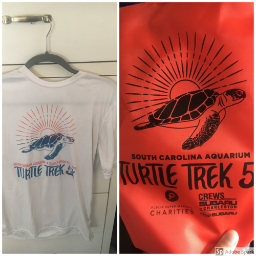

import '../../../src/components/fontawesome';
import { FontAwesomeIcon } from '@fortawesome/react-fontawesome';

<FontAwesomeIcon icon={['fas', 'star']} size="lg"/>
<FontAwesomeIcon icon={['fas', 'star']} size="lg"/>
<FontAwesomeIcon icon={['fas', 'star']} size="lg"/>
<FontAwesomeIcon icon={['fas', 'star']} size="lg"/>
<FontAwesomeIcon icon={['far', 'star']} size="lg"/>

### Summary
This race report is for the Turtle Trek **5K**, which takes place in **Isle of Palms, SC**, and benefits the South Carolina Aqaurium's Sea Turtle Rescue program.
There is also a **virtual option.** The course is a down and back on the beach at Isle of Palms starting at the station near the county park parking lot.
**Before the race there's also a beach sweep you can participate in and an after party.**

[If you liked this review or found it helpful, you can like it on BibRave.](https://www.bibrave.com/races/south-carolina-aquarium-turtle-trek-reviews/14003)

[To learn more about the race beyond this review or to sign up, visit the race website.](https://jicrun.com/)

### T-Shirts/SWAG

This might be my favorite race T-Shirt. It's dri-fit material and the colors are so cute. Plus, there's a turtle on it, so what's not to love? You also get a drawstring bag with some swag in it and a story about a sea turtle you're saving. It's also nice when you go to the little "expo" area before the race to put extra free stuff in. No medal.

### Aid Stations
There is one aid station halfway with good volunteers making sure none of the trash gets into the ocean. I always include the finish line food/drink in the "aid station" category. Maybe I shouldn't haha, but I'm taking away a star because the station where you get the free food after is at a restaurant down the street from the finish and it's such a small crammed area with a long line plus the food was cold and there wasn't vegetarian options

### Course Scenery
It's on the beach which is gorgeous but it's also just a down and back so the novelty wears off after halfway.

### Expo Quality
There's a small expo at the starting area of the race. The number of vendors is small but you can get some fun swag and there's a beach sweep you can participate in that's actually pretty fun and gets you warmed up walking on the beach.

### Elevation Difficulty
The elevation is flat but it's on the beach so if you aren't used to running on the beach it can be kind of difficult depending on how packed the sand is.

### Parking/Access
You don't have to pay for parking in the IOP County Park lot if you're doing the race but there aren't very many spots and I don't think it's closed off to racers only. Carpool if you can!

### Race Management
I thought the race was managed very well. It's for a great cause and for being a local race, they make it feel like a big event worth the money. They even have a Planet Fitness instructor have everyone do a stretching routine before starting the race. Thanks for looking out for the runners!

### Conclusion
I love this race and would definitely recommend it. It's unique since you get to run on the beach the whole time. You get some good swag. The after party is in too small of an area, but it's still fun to check out for a bit and enjoy some live music. I would probably skip the free food honestly and just grab something on my own. Make sure to carpool and hydrate because the salty air will dry out your mouth, but in my opinion it's worth it for the great cause and the fun atmosphere.