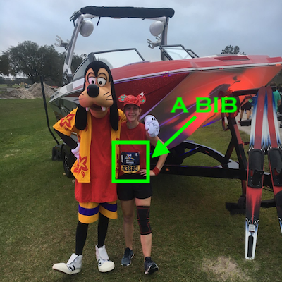

Back in January 2020, I ran my first half marathon during the Walt Disney World Marathon Weekend along with one of my friends, while my boyfriend ran the marathon.
If you're curious about that experience, [you can check out my race report here!](http://melted-boundary.surge.sh/race-reports/wdw-half-marathon-2020).
While I tried to incorporate some advice and tips in that race report, I thought I'd dedicate an entire post to some lessons I learned during my first runDisney experience.
So let's get right down to it!

Actually real quick... I use the word "bib" a lot in this post. Just in case you don't know what a bib is, it's that square paper you pin to your clothes when you race that distinguishes you from the other runners and indicates your registration with the race.
So sometimes I may interchange it with "registration."

Now let's get started!!

### Should I Make This My First 5K/10K/Half/Marathon?

I made the decision to do my first half marathon at the WDW Marathon Weekend because I was intimidated by the distance.
Having a theme like Disney took some of that fear away. Not only that, but so many people run their first race distance (or even first race in general) during this weekend.
Furthermore, there is such an air of celebration during this weekend that adds so much reward to your finish! I mean what better way to celebrate your first race
than to go to Disney World? And, because it's such a big race, there are so many events at the expo to enjoy and lots of on-course volunteers, aid stations, medical staff, etc.
to help propel you to the finish line. When it came down to it, a part of me thought I may never want to do a half marathon again (LOL), so I might as well go big or go home!
I say "LOL" because I think the whole runDisney atmosphere made me want to do more races. It's hard to say if I would've felt the same way doing a non-runDisney race.

But what about reasons not to make this your first race? For one, it's expensive in both cost and time. 
The reason the runDisney races are so expensive is because... it is Disney. I mean there are also all the road closures and cast members they need to pay,
but a big part of the cost is that you are doing something Disney.

To make the price worth it, you may want to take advantage of everything the weekend has to offer.
This includes all the character stops on the course. Where I went wrong during the half is I only stopped for 2 characters (more about this later). 
Because it was my first half, I didn't want to stop too much but also later regretted not stopping for as many characters. I also know that if I stopped for more characters, I would've regretted stopping too much for my first half.
If you think you'd probably struggle with this catch-22, it might be good to do the distance at a different race first so you feel more comfortable stopping for these photo opportunities.
The high cost and amount of time spent trying to budget and plan could also add some unnecessary stress to the race, whereas if you stuck to something more local, you wouldn't have to worry about this at all.

Overall though, you will not regret doing a runDisney race and you will also not regret deciding to do a different race because at the end of the day, you will be so proud of yourself. And trust me, you will want to do more races anyway!

### Wait there's more than one weekend? How do I choose?

Okay, so you read that first section and decided, yep, this is the race I'm doing, so you go to runDisney's website and OMG... there are like a million race weekends (okay 4 weekends) to choose from. How do I decide?
Let's break these down...

##### Walt Disney World Marathon Weekend

* **When:** It's ALWAYS the weekend before MLK weekend, with the 5K on Thursday and the optional Castaway Cay Challenge on the following Tuesday (set sail Monday)
* **Distances:** 
    * 5K
    * 10K
    * Half
    * Full
    * Half + Full (Goofy Challenge)
    * 5K + 10K + Half + Full (Dopey Challenge)
    * Any of the previous races in the list + 5K on Castaway Cay (Castaway Cay Challenge)
    * Kids 1 Mile Fun Run (Ages 4 - 13)
    * Kids Dashes: 100 meter (Ages 1 - 4), 200m (Ages 5 - 8), 400m (Ages 7 - 8), Diaper Dash (Ages <= 12 months)
* **Price:** Typically the least expensive for each individual race
* **Themes:** Kids races are Chip and Dale, 5K is Pluto, 10K is Oswald, Half is Donald, Full is Mickey + Minnie, Goofy is Goofy, Dopey is Dopey. BUT in general people just dress in whatever Disney theme their heart desires.
* **Runs Through:** 
    * Epcot (All)
    * Magic Kingdom (Half, Full)
    * Animal Kingdom (Full)
    * Hollywood Studios (Full)

##### Princess Half Marathon Weekend

* **When:** It's almost always the last weekend of February.
* **Distances:** 
    * 5K
    * 10K
    * Half
    * 10K + Half (Fairy Tale Challenge)
    * Kids 1 Mile Fun Run (Ages 4 - 13)
    * Kids Dashes: 100 meter (Ages 1 - 4), 200m (Ages 5 - 8), 400m (Ages 7 - 8), Diaper Dash (Ages <= 12 months)
* **Price:** Typically the more expensive half marathon. For example, in 2020, the WDWMW Half was $188, while this one was $210.
* **Themes:** Each race changes its theme every year, but it will be Disney Princess related for sure! Most people dress up in something princess-related, but like with every Disney race, you can dress in whichever theme you want!
* **Runs Through:** 
    * Epcot (All)
    * Magic Kingdom (Half)

##### Wine and Dine Half Marathon Weekend

* **When:** It's almost always the first full weekend of November when the time change happens.
* **Distances:** 
    * 5K
    * 10K
    * Half
    * 10K + Half (Two Course Challenge)
    * Kids 1 Mile Fun Run (Ages 4 - 13)
    * Kids Dashes: 100 meter (Ages 1 - 4), 200m (Ages 5 - 8), 400m (Ages 7 - 8), Diaper Dash (Ages <= 12 months)
* **Price:** Typically around the same price as Princess. However, your entry fee includes an after party.
* **Themes:** Each race changes its theme every year, but it will be somewhat food related, like this past year's "Deliciously Wicked" villain theme. People will dress up as any Disney theme they want, something to do with the theme for the medals, or something Epcot related in celebration of the Wine and Dine Festival.
* **Runs Through:** 
    * Epcot (All)
    * Animal Kingdom (Half)
    * Hollywood Studios (Half)

##### The Weekend Formerly Known as Star Wars Rival Run

This was a Star Wars themed weekend that took place around mid-April with half, virtual half, 10K, and 5K options. However, runDisney recently
announced that they will be re-theming the entire weekend, so I don't want to assume the information relevant to the Rival Run Weekend will carry over to whatever the new weekend is.

##### Still don't know what to choose?

* Want to run a marathon? *Marathon Weekend*
* Want the cheapest option? *Marathon Weekend*
* Want a more atheltic vibe? *Marathon Weekend*
* Want to pair your vacation with a Disney Cruise? *Marathon Weekend Castaway Cay Challenge*
* Want to run through the castle? *Marathon or Princess Weekend*
* Want a more female-centric race? Girls weekend? *Princess*
* Obsessed with princesses? *Princess* 
* Want the best merch options? *Princess*
* Want the Half to be the main event? *Princess, Wine and Dine, or whatever the new Star Wars weekend may be*
* Want a more chill weekend? *Wine and Dine*
* Love the Wine and Dine Festival? *Wine and Dine*
* Want to go to a cool after party? *Wine and Dine*

### I've chosen my weekend! Now how do I register for it?

* **Create a runDisney account** here: https://manage.rundisney.com/login/rundisney. If there is an error on the page, try refreshing or go to https://www.rundisney.com > Click Help & Support > Click Manage Account.
* **Signup for e-mail updates** from runDisney here: https://www.rundisney.com/email-signup/. Or follow on social media for updates.
* **Know when registration opens.** Registration is typically at 10 AM EST. The following were the planned dates for general registration for the 2021 races and the 2020 Wine and Dine Weekend:
    * Wine and Dine Half Marathon Weekend: March 10, 2020
    * Marathon Weekend: May 12, 2020
    * Princess Weekend: June 16, 2020
    * Star Wars Weekend: August 11, 2020
* **Want to register early?** Those who are annual passholders, Disney Vacation Club members, Golden Oak residents, or Club 33 members get access to register for races early. When you sign up for a runDisney account, you can link it with whichever Disney account you have that stores this information, and I think it will just know.
I wish I knew more, but because I don't have any of these perks, I'm not going to speak on the experience. I do know that it's always a few days before general registration and they only sell a limited number of registrations during this time. So if you miss out, you can still register later.
* **Want to register early but not one of the people listed above?** You can use a travel agent to book your trip along with your bib and when general registration opens, you'll receive a specific link to register for your bib. You can find travel agents in the [runDisney Marketplace Facebook group](https://www.facebook.com/groups/795310493890240/) if you don't have one you like to use.
Also, Disney travel agents are free to use, so if someone is charging you for their services in addition to your trip, it's probably a scam. 
* **Didn't get your registration early?** No worries, you can sign up ON the day of general registration. When I registered for my half, it was about a month later and I don't think it sold out until September. But, with COVID-19 causing runDisney events, as well as most other races, to go virtual, more people will be itching to register. 
Also, some years they can sell out super fast because it's an anniversary year for the race or people love the theme. Basically, you just never know but it's always best to assume it will sell out, so try to have a browser open on the registration page 5 minutes before registration opens. Don't refresh the page!
Personally, I try to have the web page open in different browsers (Chrome, Firefox, and Safari) and at least one on my phone. This came in handy registering for the runDisney Virtual Summer Series since I had a data blocker Chrome extension causing some issues on the checkout form, but the other browsers didn't have that extension and therefore didn't have that problem.
* **Paying with a gift card?** You have to make sure it is all on one gift card AND that it covers the entire fee. So if you get some Disney gift cards you want to put them towards your race, go to https://www.disneygiftcard.com/ to manage the amounts and put them on one card. I believe the service fee is around 6.6%, but definitely no more than that. No harm in putting more on the card, but you won't be able to use it if you put less.
* **Still didn't secure a registration or realized it just wasn't in the budget?** Sign up for the race with a "charity bib." Each race has non-profits that runDisney gives bibs to. You can actually register through this non-profit, and instead of paying for the bib, you raise a certain amount of money for the charity. [You can find participating charities here, filtering by race weekend.](https://www.rundisney.com/events/disneyworld/travel-providers-charities/disneyworld-marathon-weekend/)

### Registration complete! Wait where do I stay? Where should I get tickets?

So if you booked with a travel agent, you probably have a room booked on the resort property as a result. 
Otherwise, you may be asking yourself if it's worth it to stay on property or not. I don't know if I can make the call 
as to whether or not it's worth it, but I can definitely say you don't have to. And I think it really comes down to whether or not you have a car.

Since we were able to drive to Disney, it was actually more expensive for us to stay on property because of the daily parking fees. Without a car,
this isn't something you have to worry about. Plus, the resorts have buses that take you to the race start. But, from other people's experiences, IF you
have a car available, it seems better to take it to the race start rather than use the provided transportation. I even know of some people who will use Uber
because they leave before the buses even do! Gotta get those pre-race character photos! You also get free parking at Epcot since you park there before the park opens.

Whether or not you stay on property, I think [the Mousesavers newsletter is very useful.](https://www.mousesavers.com/mousesavers-newsletter-signup/)
They are always sharing discounts for ["best friend hotels"](https://disneyspringshotels.com/our-7-hotels/) that not only are at a reduced rate, but they also sometimes
waive resort fees and parking fees. I believe some of these do actually have transportation to some of the races, but I'm not sure which ones. They do however all have easy access to Disney Springs,
transportation to all Disney parks, extra magic hours, and 60 day fast pass reservations. So, you still get a lot of the perks you get staying on property, but less of a "Disney" feel.
Our hotel did have Mickey waffles though!

If you still would rather stay on property, the newsletter offers subscribers extra deals on [Undercover Tourist](https://www.undercovertourist.com/). They also have discounts on resort rooms sometimes as well! The only resort I've seen mixed opinions on for race transportation is Caribbean Beach, so that's something to keep in mind.

Undercover Tourist is also the only authorized seller of discounted Disney tickets, so look here for Disney tickets and even Universal Studios if that's your jam.

### Should I go to the parks before, day of, and/or after the race?

Pretty much the answer to all these questions is "it depends." 
If you are doing the 5K or 10K, I think for sure you should be able to hit the parks that day. You may be super tired after, but you should be finished in time to take a nap and go to the parks.
For the half and the full, if this is your first time doing that distance, you should really clock how you feel after your longest run in training. 
My boyfriend did the marathon and hit the parks right after no problem. My friend and I went to Epcot and Magic Kingdom as soon as we finished the half.
But, something you'll learn about running is that everyone is different! 

For Goofy and Dopey, I can't even imagine being jazzed enough to hit the parks. Even if you're used to running those distances, getting up that early for multiple days is tiring. 
You may be able to get away with it with Goofy, but Dopey? Probably not... but again everyone is different!

### Should I run in costume?

Yes, but you don't have to! If it's going to stress you out to make something, don't sweat it!
There's a Facebook group called [runDisneyRun Marketplace](https://www.facebook.com/groups/runDisneyrunMarketplace) where lots of people sell both new and old costumes.
Also, your costume doesn't have to be exact. Lots of people do "Disney Bounding", [which according to this article is,](https://www.today.com/style/what-disneybounding-see-trend-loved-disney-enthusiasts-t136403#:~:text=%22It's%20about%20using%20clothing%20items,%E2%80%94%20whatever%20that%20may%20be.%22)
"about using clothing items you find in your own closet or at your local mall to create an outfit based off your favorite Disney character ...
It's a subtle way to dress as your favorite character without being in costume while sporting your own personal style — whatever that may be."

At the end of the day you won't look weird if you run in costume and you won't look weird if you don't! I think it's one of the most fun parts of the race, but races should be fun and if you're someone who would stress about it, don't!
If you do have a costume, make sure you do a training run in it so you know how it feels to run in it.

### How fast do I need to be?

For the 5K you probably can't take all day but there are people who have done it in 1.5 hours 
and were able to complete it and get their medals. Basically, the race just isn't really timed, so there isn't a cutoff like the other races.

If you look at runDisney's website, it will tell you that you need to maintain a 16:00 minute per mile pace
for the 10K, Half, and Full. What it doesn't tell you is that you must maintain a 16:00 minute per mile pace,
starting from the last person to cross the start line. So, if you're in an earlier corral, you can take a little bit longer.

To help the racers figure out how they're doing on pace, there are these people called "The Balloon Ladies."
These women start right after the last person crosses the start line and maintain that 16:00 min./mile pace
the entire race. As long as you stay in front of them, you're golden! They're really nice and sometimes will allow people to share their bib
numbers so you can track them during the race. 

### What are character stops? Can I stop at all the characters? Should I get Photo Pass?

"Character stops" refer to points along the course where you can take pictures with different Disney characters. 
During the half last year I stopped to take pictures with only 2 charcters:
1. Goofy who was wearing vacation clothes and in front of a yacht
2. Stitch in his lai

For reference, I was in corral E. I definitely could've stopped for way more characters. In fact, I regret not stopping for more! 
My boyfriend did the marathon and was in corral in D. He stopped for so many characters due to the extreme heat and also dealing with an injury. 
He had a great time and isn't even a Disney fan (Crazy... I know right?!).

However, the later the corral you are in, the longer these character stop lines get, so you'll have to limit the number. My friend started in H and she didn't stop for any characters since the lines were so long. 
I would say ahead of time, pick out 3 characters where you think, "okay if I see this character, I'm stopping" or if you're running with friends, each of you should have a figurative "emergency character stop card" that you can
pull out when you see a certain character meaning you all HAVE to stop and take a picture. If you want to be even more conservative, limit yourself to only stopping when you see a character that fits with your costume theme. For
example, stopping for the Queen of Hearts or Tweedle Dee and Tweedle Dum if you're wearing an Alice in Wonderland costume. 

Just be mindful of your pace. Wear a GPS watch that tracks your pace if it helps or take the advice from the section prior and try to track the balloon ladies. 
I believe some of them are in the runDisneyRun Facebook group I mentioned and will happily share their bib numbers. Obviously, don't be creepy and seek out the number if they aren't willing to dole out that information themselves.

In regards to PhotoPass, you don't have to get it to get your character photos. You can hand your own phone to a cast member to take the picture. 
These don't come out as good, so if you want really nice pictures, get the PhotoPass, especially if you expect to stop for lots of characters. 
If you see people in bright green tents, those are the race photographers and you can only get the photos they take of you if you have PhotoPass, so keep that in mind.

### How do I stay motivated during training?

1. Something that got me pumped for my runDisney race is having a Disney playlist that I would break out during my runs when I was struggling. 
It helped me visualize the course and convert my pain from running into excitement. 

2. Speaking of visualizing the course, there are tons of YouTube videos of runDisney race recaps! My favorites are
Joyful Miles and RunningInMakeup. There are several others that you can check out in the next section. 

3. Build a vision board. I didn't do this for my runDisney half marathon, but I did so for my first marathon, and it helped immensely. 

4. Come up with a list of Disney movies to watch in the days leading up to the race. Not only does it get you excited for your trip, but 
you'll have more time on your hands since you'll be tapering the closer you are to race day.

### Still really nervous about all these pre-race decisions? Want some good runDisney social media to check out?

Time to plug some of my favorite runDisney vlogs, podcasts, etc. that helped me with all my decision making:
1. [The runDisneyRun Facebook Group](https://www.facebook.com/groups/1413755672283628)
2. [Joyful Miles!](http://joyfulmiles.com/) Also check out their YouTube channel, podcast, and Facebook group!
3. [RunningInMakeup](https://www.youtube.com/channel/UCSunzTicx9FqaNm30-j6LPA) is a great YouTube channel for getting hyped about Disney races and training. She doesn't really do advice videos, but I really like her vlog style. 
4. [Medals & Tiaras](https://www.youtube.com/channel/UCcQsx8VPeEZ9dmXrQrur2UA) has some great advice and she actually just started a Running 101 video series. 

### Thank you

Thanks for taking the time to read this! Hopefully, it was helpful in helping you prepare for your first runDisney experience! Keep it up with the training and good luck with your race!

